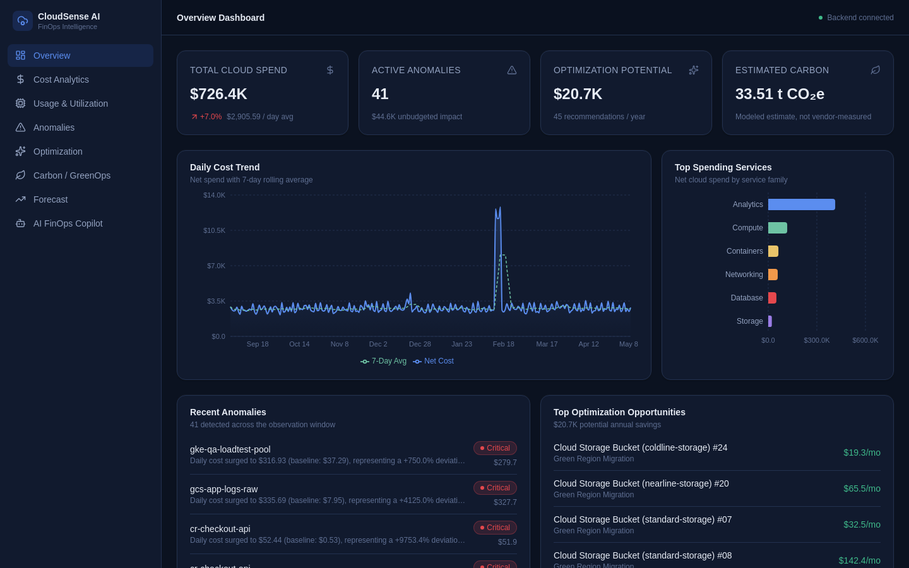
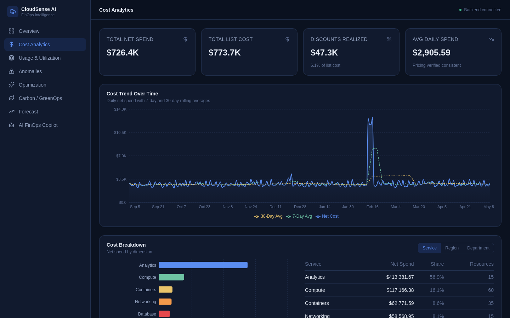
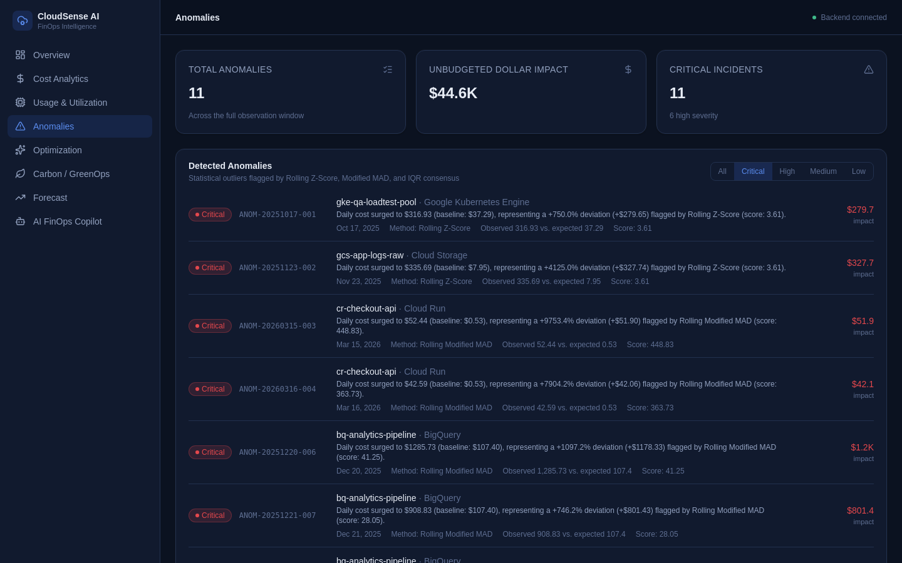
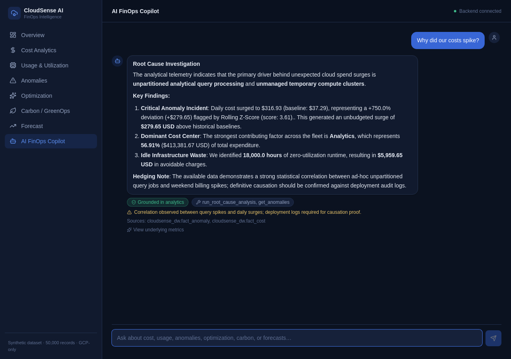

# CloudSense AI

**A cloud cost, usage, and carbon intelligence platform with a Gemini-grounded FinOps Copilot.**

Organizations running non-trivial cloud workloads routinely struggle with
cost opacity, silent waste, unnoticed spend anomalies, and a growing need to
understand their infrastructure's carbon footprint. CloudSense AI models
that whole problem end-to-end: a synthetic but realistic cloud billing
dataset flows through a medallion data pipeline, feeds a suite of analytics
and ML engines (cost, utilization, anomaly detection, forecasting,
optimization, carbon estimation), and is exposed through a FastAPI backend,
a React dashboard, and a conversational AI Copilot that answers FinOps
questions **strictly grounded in that backend data — it is never allowed to
invent a number.**

> **All data in this project is synthetic**, generated by a seeded, configurable
> generator (`src/generator/`). There is no real cloud account, no real
> invoice, and no real infrastructure behind it. Carbon figures are modeled
> estimates, not official Google Cloud Carbon Footprint measurements. See
> [Dataset](#dataset) for details.

---

## Highlights

| Area | What's demonstrated |
|---|---|
| **Full-Stack Development** | FastAPI backend + React/TypeScript/Vite frontend, fully typed end-to-end with zero schema drift between them (verified). |
| **Data Engineering** | A medallion architecture (Bronze → Silver → Gold → Marts) over Parquet, plus a local DuckDB warehouse and an optional, isolated BigQuery adapter sharing one schema source of truth. |
| **Analytics & ML** | Statistical anomaly detection (Z-score/MAD/IQR consensus), a 3-model forecasting benchmark (baseline, Ridge, Random Forest) evaluated on a chronological holdout, and rule-based optimization recommendations — all explainable, none black-box. |
| **AI / Gemini Copilot Architecture** | Tool-calling Gemini integration with a whitelisted tool registry, explicit anti-hallucination grounding, and a fully-functional deterministic offline fallback mode that needs no API key. |
| **FinOps** | Cost breakdowns, trend analysis, waste/idle-resource detection, and rule-based savings recommendations with clear rationale. |
| **Carbon / GreenOps** | Scope 2/3 carbon estimation methodology, regional carbon-intensity comparison, and a green-migration simulator — all explicitly labeled as modeled estimates. |
| **API & Backend Engineering** | A clean, layered FastAPI service (routers → service layer → data), audited for security (CORS, injection, credential handling) and correctness in a dedicated production-hardening pass. |

---

## Screenshots

### Executive Overview



### Cost Analytics



### Anomaly Detection



### AI Copilot in Action



All four screenshots above are captured directly from the running application (FastAPI backend + React frontend) against the local synthetic dataset — not mockups.

---

## Table of Contents

- [Architecture at a Glance](#architecture-at-a-glance)
- [Frontend](#frontend)
- [Dataset](#dataset)
- [Medallion Architecture](#medallion-architecture)
- [Analytics & ML](#analytics--ml)
- [AI Copilot](#ai-copilot)
- [API Reference](#api-reference)
- [BigQuery Data Warehouse (Optional)](#bigquery-data-warehouse-optional)
- [How to Run Locally](#how-to-run-locally)
- [Example API Usage](#example-api-usage)
- [Testing](#testing)
- [Project Structure](#project-structure)
- [Roadmap](#roadmap)

---

## Architecture at a Glance

```text
Synthetic Dataset (50,000 rows, generated locally, seeded/reproducible)
        │
        ▼
   Bronze → Silver → Gold  (medallion pipeline, Parquet)
        │
        ├──────────────────────────────┐
        ▼                              ▼
Analytics Marts + DuckDB       Analytics/ML Engines
  (local SQL warehouse,          (Cost, Usage, Anomaly Detection,
   ad-hoc querying)               Forecasting, Optimization, Carbon)
        │                              │
        │                              ▼
        │                     analytics_summary.json
        │                     (what the live API actually reads)
        │                              │
        │                              ▼
        │                        FastAPI REST API (/api/v1/...)
        │                              │
        │                    ┌─────────┴─────────┐
        │                    ▼                    ▼
        │           React Frontend        Gemini FinOps Copilot
        │           (dashboard, 8 pages)   (POST /api/v1/chat)
        │
        ▼
BigQuery (OPTIONAL — a separate, isolated, manually-triggered
          migration path for the Gold/Marts layer; not used by
          the live API; requires a real GCP project to execute)
```

**Two things worth being precise about, since they're easy to conflate:**

- The **live API/frontend/AI Copilot** read exclusively from
  `data/analytics_summary.json`, produced once by `run_analytics.py`.
- The **DuckDB/Marts warehouse** (and the optional BigQuery mirror of it)
  is a separate, independently-queryable SQL layer over the same Gold data —
  useful for ad-hoc analysis and demonstrating warehouse design, but it is
  **not** in the live request path of the running application.

**Layer responsibilities:**

| Layer | Responsibility |
|---|---|
| **Synthetic Dataset** | A reproducible, seeded 50,000-row cloud billing/usage dataset. |
| **Bronze** | Raw ingestion with lineage/audit metadata. No business logic. |
| **Silver** | Cleans and validates data; enforces cost/carbon accounting identities. |
| **Gold** | Dimensional star schema: 5 dimensions, 4 facts. |
| **Analytics Marts / DuckDB** | Pre-aggregated marts, also queryable as local SQL views — independent of the live API. |
| **Analytics + ML Engines** | Compute cost/utilization stats, detect anomalies, forecast spend, generate optimization recommendations, estimate carbon — output written once to `analytics_summary.json`. |
| **FastAPI** | Stateless REST API serving `analytics_summary.json` through a typed service layer. |
| **React Frontend** | A working TypeScript/Vite dashboard (8 pages) consuming the API exclusively over HTTP — implemented, not planned. |
| **Gemini FinOps Copilot** | Conversational layer (`POST /api/v1/chat`) that calls the *same* backend tools the API exposes and narrates the result. |
| **BigQuery** | An optional, isolated cloud warehouse mirror — built and structurally validated, but not executed against a real GCP project in this environment, and not wired into the live API. |

---

## Frontend

`frontend/` is a React + TypeScript + Vite single-page dashboard — **implemented and verified**, not a future item. It consumes the FastAPI backend exclusively over HTTP and contains no analytics logic and no direct Gemini calls of its own.

**Stack:** React 19, TypeScript (strict), Vite, React Router, Tailwind CSS, Recharts, Axios, react-markdown, lucide-react.

**Pages** (all backed by real, verified backend endpoints):

| Page | Route | Primary endpoints |
|---|---|---|
| Overview Dashboard | `/` | `/dashboard/summary`, `/cost/trends`, `/cost/by-service`, `/anomalies`, `/optimizations` |
| Cost Analytics | `/cost` | `/cost/summary`, `/cost/trends`, `/cost/by-{service,region,department}`, `/cost/resources` |
| Usage & Utilization | `/usage` | `/usage/summary`, `/usage/services`, `/usage/correlations` |
| Anomalies | `/anomalies` | `/anomalies` |
| Optimization | `/optimization` | `/optimizations` |
| Carbon / GreenOps | `/carbon` | `/carbon/summary`, `/carbon/by-region`, `/carbon/trends`, `/carbon/simulate-migration` |
| Forecast | `/forecast` | `/forecast/summary`, `/forecast/models`, `/forecast/projections`, `/cost/trends` |
| AI FinOps Copilot | `/copilot` | `/chat`, `/ai/tools-manifest` |

Verified: production build succeeds (`npm run build`), lint is clean (`npm run lint` — 0 warnings, 0 errors), and every TypeScript response type was cross-checked against live API responses with no schema drift found.

See [`docs/frontend_architecture.md`](docs/frontend_architecture.md) for component structure, data flow, and the Copilot UI's grounding contract.

---

## Dataset

The dataset is **entirely synthetic** — generated by `data/generate_dataset.py` using a fixed random seed. It does not represent any real organization, account, or invoice.

| Property | Value |
|---|---|
| Rows | **50,000** |
| Time span | **250** contiguous days (2025-09-01 → 2026-05-08) |
| Unique resources | **200** |
| Cloud provider | **GCP only** (single-provider synthetic environment) |
| Regions | Iowa (USA), Northern Virginia (USA), Zurich (Switzerland), St. Ghislain (Belgium), Mumbai (India) |
| Random seed | `RANDOM_SEED = 42` (`src/generator/config.py`) — reproducible |
| Format | `data/cloudsense_50k.csv` and `data/cloudsense_50k.parquet` |

**Key fields** (47 columns total) include:
- Organizational: `project_id`, `department`, `cost_center`, `environment`
- Resource: `resource_id`, `resource_type`, `service_family`, `sku`, `region`
- Pricing/cost: `usage_quantity`, `list_cost_usd`, `discount_amount_usd`, `net_cost_usd`
- Utilization: `avg_cpu_utilization_pct`, `max_cpu_utilization_pct`, `avg_ram_utilization_pct`, `disk_iops`, `network_ingress_gb`, `network_egress_gb`, `is_idle`
- Carbon: `pue_factor`, `grid_carbon_intensity_gco2_per_kwh`, `energy_consumed_kwh`, `scope2_location_based_gco2e`, `scope3_embodied_gco2e`, `total_carbon_gco2e`
- Anomaly labeling: `anomaly_flag`, `anomaly_type`
- Optimization labeling: `optimization_category`

**Enforced consistency invariants** (validated in the test suite):
- `net_cost_usd == list_cost_usd − discount_amount_usd` (within floating-point tolerance)
- `total_carbon_gco2e == scope2_location_based_gco2e + scope3_embodied_gco2e`
- `max_cpu_utilization_pct >= avg_cpu_utilization_pct`, and utilization is bounded `[0, 100]`

**Carbon is an estimate, not an official provider measurement.** It is derived from server power benchmarks, a PUE factor, and regional electricity grid carbon-intensity figures baked into the generator — it does **not** come from Google Cloud's Carbon Footprint tooling. This distinction is surfaced explicitly by the API and the AI Copilot.

---

## Medallion Architecture

Implemented in `src/pipeline/etl.py` (`MedallionETLPipeline`), orchestrated by `run_pipeline.py`:

1. **Bronze** — ingests the raw CSV as-is with ingestion metadata for lineage/audit. No transformation of business fields.
2. **Silver** — cleans and normalizes data, enforces cost/carbon accounting identities, validates utilization bounds.
3. **Gold** — builds a star schema: 5 dimension tables, 4 fact tables, with referential integrity.
4. **Analytics Marts** — pre-aggregates Gold into 6 presentation marts (cost summary/trends, utilization, anomalies, optimization opportunities, carbon emissions).
5. **DuckDB Warehouse** (`src/pipeline/warehouse.py`) — registers every Gold table and mart as a SQL view over Parquet in a local `.duckdb` file, with paths resolved dynamically so the warehouse is portable across machines.
6. **Validation** (`src/pipeline/validator.py`) — automated reconciliation checks (row counts, key uniqueness, financial/carbon totals across layers), written to `data/warehouse_validation_report.md`.

---

## Analytics & ML

All engines live under `src/analytics/` and `src/ml/`, orchestrated by `run_analytics.py`; combined output is written once to `data/analytics_summary.json` — the single source of truth the FastAPI layer and AI Copilot both read from.

| Engine | Module | Approach |
|---|---|---|
| **Cost Analytics** | `cost_analyzer.py` | Aggregates net/list/discount spend by service/region/department/environment; daily trends with 7d/30d rolling averages; verifies pricing consistency across the full dataset. |
| **Usage Analytics** | `usage_analyzer.py` | Fleet-wide CPU/RAM/storage utilization statistics, per-service profiles, empirical load-to-cost correlations. |
| **Anomaly Detection** | `ml/anomaly_detector.py` | Rolling Z-score, Modified MAD, and IQR fences combined into a consensus signal — explainable by design, not a black-box classifier. |
| **Forecasting** | `ml/forecaster.py` | Compares a 7-day seasonal baseline, Ridge Regression, and Random Forest, evaluated on a **chronological holdout split** (never random-shuffled) via MAE/RMSE/MAPE; best model selected as "champion." |
| **Optimization Engine** | `ml/optimizer.py` | Deterministic, auditable rules: zombie-asset termination, compute rightsizing, storage-tier lifecycle, green-region migration. |
| **Carbon Estimation** | `carbon_calculator.py` | Server power benchmarks + PUE + regional grid intensity → Scope 2/3 emissions per resource. |

Every method here is chosen for explainability: anomalies trace back to a specific numeric deviation, forecasts are validated without look-ahead leakage, and optimization recommendations are rule-based, not opaque scores.

---

## AI Copilot

`src/ai/` implements the **Gemini FinOps Copilot**, exposed at `POST /api/v1/chat`.

**Design principle:** Gemini is an explanation/reasoning layer only. It never independently computes, estimates, or "remembers" a number — it routes a question to a whitelisted backend tool and narrates the verified result.

### Two execution modes

| Mode | When it's used | Verified status |
|---|---|---|
| **Deterministic / offline mode** (default) | No Gemini API key configured, or `CLOUDSENSE_AI_MOCK_MODE=true` | ✅ Fully tested — this is what the entire test suite and CI exercise. No network call, no external dependency. |
| **Live Gemini mode** | A valid `GEMINI_API_KEY` is configured | Implemented and structurally verified (including fixes made during a dedicated hardening pass — see below), but **has not been executed against a real Gemini API key in this environment.** The corresponding live test is present and passes when a key is supplied, and is otherwise correctly skipped. |

Both modes return the same `ChatResponse` shape and call the same tool registry.

### Tool-based architecture

The Copilot can only call functions in an explicit whitelist, `TOOLS_REGISTRY` (`src/ai/tools.py`), each wrapping `AnalyticsService`:

| Category | Tools |
|---|---|
| Cost | `get_cost_summary`, `get_cost_breakdown`, `get_cost_trends` |
| Utilization | `get_resource_utilization`, `get_resource_details` |
| Anomalies | `get_anomalies`, `get_anomaly_details` |
| Optimization | `get_optimization_opportunities`, `simulate_green_migration` |
| Carbon | `get_carbon_summary`, `get_carbon_by_region` |
| Forecasting | `get_forecast`, `get_forecast_models` |
| Root cause | `run_root_cause_analysis` |

### Grounding & hallucination prevention

- The system prompt (`src/ai/prompts.py`) instructs the model to ground every numeric claim in tool output, hedge causation language, and disclose unavailable data.
- Every `ChatResponse` includes `relevant_metrics` — the exact numeric values behind the answer — so responses are auditable, not just prose.
- Questions outside the dataset's scope (e.g., "my AWS spend" — this project is GCP-only) are routed to **no tool**, and the Copilot explicitly says the data isn't available.
- Carbon answers always carry an explicit "estimate, not an official measurement" warning.
- **If a tool fails, the failure is always disclosed via `warnings` and `is_grounded: false`** — this is not left to depend on whether the model's own phrasing happens to mention it (a real gap found and fixed during a dedicated hardening/audit pass).

---

## API Reference

Base path: **`/api/v1`**. Interactive OpenAPI docs at `/api/v1/docs` when running.

| Method & Path | Purpose |
|---|---|
| `GET /health` | Service health, version, whether analytics data is loaded. |
| `GET /dashboard/summary` | Executive KPI rollup. |
| `GET /cost/summary`, `/by-service`, `/by-region`, `/by-department`, `/trends`, `/resources` | Cost breakdowns and trends. |
| `GET /usage/summary`, `/services`, `/correlations` | Utilization and waste. |
| `GET /anomalies`, `/anomalies/{id}` | Detected statistical anomalies. |
| `GET /optimizations`, `/optimizations/{id}` | Optimization recommendations. |
| `GET /carbon/summary`, `/by-region`, `/trends`; `POST /carbon/simulate-migration` | Carbon/energy analysis and migration simulation. |
| `GET /forecast/summary`, `/models`, `/projections` | Forecasting outputs. |
| `GET /ai/context`, `/ai/tools-manifest` | LLM grounding context and tool schema. |
| **`POST /chat`** | **The FinOps Copilot chat endpoint.** |

### `POST /api/v1/chat`

**Request:**
```json
{
  "message": "What are my optimization opportunities?",
  "conversation_history": []
}
```

**Response** — a real, captured example from deterministic mode:
```json
{
  "answer": "### FinOps Optimization Recommendations\n\nThe optimization engine has identified **45 actionable efficiency opportunities**...\n\n- **Potential Monthly Savings**: **$1,728.86 USD / month**\n- **Potential Annual Savings**: **$20,746.32 USD / year**",
  "tools_used": ["get_optimization_opportunities"],
  "analytical_sources": ["cloudsense_dw.mart_optimization_opportunities"],
  "relevant_metrics": { "monthly_savings_usd": 1728.86, "annual_savings_usd": 20746.32 },
  "warnings": [],
  "is_grounded": true
}
```

---

## BigQuery Data Warehouse (Optional)

CloudSense AI includes an **optional, additive** Google BigQuery warehouse mirroring the local Gold/Mart Parquet layer: schema, 4 partitioned+clustered fact tables, 5 dimensions, 6 marts, and 11 analytical views, all generated from one shared schema definition (`src/pipeline/schema.py`).

**This is a separate, isolated integration:**
- The running API and frontend are **unaffected** — `AnalyticsService` reads `data/analytics_summary.json` exclusively, regardless of whether BigQuery has ever been provisioned.
- `google-cloud-bigquery` lives in its own `requirements-bigquery.txt`, never installed by default.
- **BigQuery has not been executed against a real Google Cloud project in this environment** — no GCP credentials are configured here. The migration/validation code is structurally tested (DDL generation, schema completeness, SQL correctness) with `pytest`, and the live-integration tests are present and correctly **skipped** without real credentials — never faked as passing.

```bash
pip install -r requirements-bigquery.txt
gcloud auth application-default login
export CLOUDSENSE_GCP_PROJECT_ID=your-gcp-project-id
python3 run_bigquery_migration.py
```

See [`docs/bigquery_migration.md`](docs/bigquery_migration.md) for full architecture, partitioning rationale, authentication, and troubleshooting.

---

## How to Run Locally

No Google Cloud account, no API key, and no external service is required for the default local application.

**Backend:**
```bash
python3 -m venv .venv && source .venv/bin/activate
pip install -r requirements.txt
uvicorn src.api.main:app --reload
# → http://localhost:8000  (docs at /api/v1/docs)
```

**Frontend** (separate terminal):
```bash
cd frontend
npm install
cp .env.example .env.local
npm run dev
# → http://localhost:5173
```

**Tests:**
```bash
pytest tests/ -v
```

That's it — the Bronze/Silver/Gold/Marts data, the DuckDB warehouse, and `analytics_summary.json` are already generated and checked into `data/`, so no pipeline run is required to start using the app. (`run_pipeline.py` and `run_analytics.py` exist to regenerate them if you want to.)

**Optional — live Gemini mode** (requires your own API key):
```bash
export GEMINI_API_KEY="your-real-gemini-api-key"
uvicorn src.api.main:app --reload
```
Without a key, the Copilot automatically runs in deterministic/offline mode — this is the default and the mode the full test suite exercises.

---

## Example API Usage

```bash
curl http://localhost:8000/api/v1/health
curl http://localhost:8000/api/v1/dashboard/summary
curl http://localhost:8000/api/v1/cost/by-service
curl http://localhost:8000/api/v1/anomalies

curl -X POST http://localhost:8000/api/v1/chat \
  -H "Content-Type: application/json" \
  -d '{"message": "Why did my costs suddenly increase?"}'
```

---

## Testing

```text
54 passed, 4 skipped
```

- All 54 passing tests run fully offline — no network access, no Gemini API key, no Google Cloud credentials required.
- **1 skipped**: `test_live_gemini_chat_smoke` — requires a real `GEMINI_API_KEY`.
- **3 skipped**: live BigQuery integration tests — require both `google-cloud-bigquery` installed and a real `CLOUDSENSE_GCP_PROJECT_ID`.
- These skips are intentional and by design in any environment without those credentials, including this one — the credential-independent parts of both integrations are fully tested; nothing is faked as passing.

```bash
pytest tests/ -v                            # everything
pytest tests/test_ai_copilot.py -v          # AI Copilot only
pytest tests/test_bigquery_integration.py -v  # BigQuery structural + live (skipped) tests
```

A dedicated production-hardening/security-audit pass (see Roadmap) reviewed the whole codebase and fixed two real bugs it found — including one where live Gemini tool-calling silently fell back to deterministic mode due to a variable-naming bug — plus an unsafe CORS configuration and a repeated-data-loading performance issue (measured ~727ms → ~4.2ms on the affected endpoint after caching). Regression tests were added for each fix.

---

## Project Structure

```text
CloudSense-AI/
├── README.md
├── requirements.txt
├── requirements-bigquery.txt     # optional, isolated BigQuery dependency
├── .env.example
├── run_pipeline.py               # ETL + warehouse entry point
├── run_analytics.py              # analytics/ML entry point
├── run_bigquery_migration.py     # manual, optional BigQuery migration script
├── docs/
│   ├── cloudsense_system_specification.md
│   ├── data_warehouse_and_marts.md
│   ├── core_analytics_and_ml.md
│   ├── api_architecture_and_reference.md
│   ├── gemini_finops_copilot.md
│   ├── frontend_architecture.md
│   └── bigquery_migration.md
├── sql/bigquery/                 # schema reference, views, analytical + validation queries
├── data/                         # dataset, bronze/silver/gold/marts, DuckDB file, analytics_summary.json
├── src/
│   ├── generator/                 # synthetic data generation
│   ├── pipeline/                  # medallion ETL, DuckDB warehouse, BigQuery adapter (optional)
│   ├── analytics/                 # cost / usage / carbon analytics
│   ├── ml/                        # anomaly detection, forecasting, optimization
│   ├── api/                       # FastAPI app, routers, service layer
│   └── ai/                        # Gemini FinOps Copilot
├── frontend/                      # React + TypeScript + Vite dashboard
└── tests/                         # pytest suite (54 passed, 4 skipped)
```

---

## Roadmap

**COMPLETED:**
- Architecture & design documentation
- Synthetic 50,000-row dataset generation
- Medallion ETL (Bronze → Silver → Gold) + Analytics Marts + DuckDB warehouse
- Core analytics (cost, usage, carbon) + anomaly detection + forecasting + optimization
- FastAPI backend with a full REST API surface
- Gemini FinOps Copilot (deterministic mode fully verified; live mode implemented and structurally verified, not yet run against a real API key here)
- React + TypeScript + Vite frontend dashboard (8 pages)
- Optional, additive BigQuery data warehouse (schema, partitioning, adapter, migration script, validation, views — not yet executed against a real GCP project here).
- **Production-hardening & security audit** — full-repository review; found and fixed real defects (live-mode tool-call handling, tool-failure disclosure, unsafe CORS configuration, a repeated-data-loading performance issue); verified all core end-to-end flows, backend/frontend schema consistency, and startup from a clean process
- Comprehensive test suite: **54 passed, 4 skipped** (skips are credential-gated, never faked)

**NEXT (not started):**
- Full browser-based end-to-end testing (build/lint/API-shape verification is done; interactive browser testing is not)
- Executing the BigQuery migration against a real Google Cloud project
- Verifying live Gemini mode against a real API key
- Switching `AnalyticsService`'s live backend from local JSON to BigQuery (the adapter exists; the swap is out of scope so far)
- Deployment (e.g. Cloud Run) — **no deployment work has been done**
