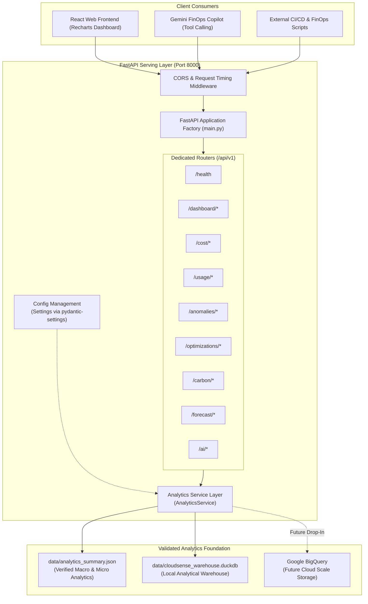

# CloudSense AI — REST API Architecture & Endpoint Reference
**API Version**: 1.0.0  
**Framework**: FastAPI (Asynchronous Python 3.12)  
**OpenAPI Specification**: 3.1.0 (Interactive Swagger UI at `/docs`, ReDoc at `/redoc`)  
**Status**: Production-Ready Serving Layer  

---

## 1. Executive Summary & Architectural Principles

The **CloudSense AI REST API** serves as the high-throughput, low-latency interface connecting validated warehouse tables and analytical models to user interfaces and AI reasoning agents.

### Core Architectural Principles
1. **Single Source of Truth**: The API never invents, approximates, or probabilistically recalculates numerical metrics on the fly. All responses originate strictly from validated analytical models and warehouse marts.
2. **Decoupled Service Layer**: Business logic, pagination, filtering, and cross-cutting aggregations are encapsulated in `AnalyticsService`, keeping route handlers lightweight and enabling future BigQuery backend swapping with zero contract changes.
3. **AI Analyst Grounding Interface**: Provides dedicated `/api/v1/ai/context` and `/api/v1/ai/tools-manifest` endpoints designed specifically to feed structured, immutable ground-truth facts to Gemini, ensuring zero numerical hallucinations.
4. **Strong Contract Typing**: 100% of endpoints enforce Pydantic V2 request and response schemas with parameter validation and descriptive error responses.

---

## 2. API Architecture & Data Flow



---

## 3. Complete REST API Endpoint Catalog

All endpoints are prefixed with `/api/v1`.

### 3.1 System Health & Root
| Method | Path | Summary | Description |
|---|---|---|---|
| `GET` | `/` | Root Metadata | Service name, version, and links to documentation. |
| `GET` | `/api/v1/health` | Service Health Check | Operational status and verification that analytics data is loaded. |

### 3.2 Executive Dashboard
| Method | Path | Summary | Key Response Fields |
|---|---|---|---|
| `GET` | `/api/v1/dashboard/summary` | Executive FinOps & GreenOps Rollup | Consolidated KPIs across spend, efficiency, carbon, anomalies, savings, and forecast. |

### 3.3 Cost Analytics
| Method | Path | Summary | Query Parameters |
|---|---|---|---|
| `GET` | `/api/v1/cost/summary` | Macro Spend & Pricing Audit | Total gross list cost, discounts, net spend, daily averages, pricing consistency boolean. |
| `GET` | `/api/v1/cost/by-service` | Spend by Cloud Service Family | Array of services sorted by spend share % (Analytics, Compute, Containers, etc.). |
| `GET` | `/api/v1/cost/by-region` | Spend by Geographic Region | Regional net cost breakdown across 5 global cloud regions. |
| `GET` | `/api/v1/cost/by-department`| Spend by Business Department | Attribution across Engineering, Data & AI, Operations, Customer Experience, etc. |
| `GET` | `/api/v1/cost/trends` | Daily Historical Cost Trends | 250 days of daily net spend with 7-day and 30-day rolling averages and growth %. |
| `GET` | `/api/v1/cost/resources` | Top Spend Assets (Paginated) | `page` (int), `page_size` (int), `search` (str), `department` (str). |

### 3.4 Resource Utilization
| Method | Path | Summary | Key Response Fields |
|---|---|---|---|
| `GET` | `/api/v1/usage/summary` | Global Fleet Utilization & Waste | Overall mean/P95 CPU and RAM, total active compute hours, idle hours, and idle cost waste. |
| `GET` | `/api/v1/usage/services` | Service Family Profiles | CPU, RAM, storage, network egress, requests, and idle count per service. |
| `GET` | `/api/v1/usage/correlations`| Load-to-Cost Elasticity | Pearson & Spearman correlations for provisioned VMs vs serverless vs BigQuery. |

### 3.5 Statistical Anomalies
| Method | Path | Summary | Query / Path Parameters |
|---|---|---|---|
| `GET` | `/api/v1/anomalies` | List Detected Statistical Anomalies| `severity` (`Critical`, `High`, `Medium`, `Low`), `limit` (int), `offset` (int). |
| `GET` | `/api/v1/anomalies/{id}` | Detailed Anomaly Diagnostic | `id` (e.g. `ANOM-20251016-001`): observed vs expected cost, score, method, explanation. |

### 3.6 Infrastructure Optimization
| Method | Path | Summary | Query / Path Parameters |
|---|---|---|---|
| `GET` | `/api/v1/optimizations` | List Prioritized Recommendations | `category` (`idle_zombie`, `compute_rightsizing`, `storage_lifecycle`, `green_migration`). |
| `GET` | `/api/v1/optimizations/{id}`| Detailed Recommendation | `id` (e.g. `REC-RIGHTSIZE-001`): monthly/annual savings, confidence, action item. |

### 3.7 Carbon & GreenOps
| Method | Path | Summary | Parameters / Payload |
|---|---|---|---|
| `GET` | `/api/v1/carbon/summary` | Macro Facility Energy & Scope 2/3 | Electrical energy (kWh), Scope 2 operational kg, Scope 3 embodied kg, carbon/\$ spend. |
| `GET` | `/api/v1/carbon/by-region` | Regional Carbon Footprint | Energy, emissions, and carbon intensity ($gCO_2e/\$$) across 5 global regions. |
| `GET` | `/api/v1/carbon/trends` | Daily Historical Carbon Trend | 250 days of daily energy and emissions with 7-day rolling averages. |
| `POST`| `/api/v1/carbon/simulate-migration`| Workload Relocation Simulator| JSON Body: `{"resource_id": "...", "target_region_id": "europe-west6"}`. |

### 3.8 Machine Learning Forecasting
| Method | Path | Summary | Query Parameters |
|---|---|---|---|
| `GET` | `/api/v1/forecast/summary` | Forecasting Horizon & Champion | Target metric, champion model (Random Forest), train/test split, projected monthly spend. |
| `GET` | `/api/v1/forecast/models` | Model Benchmarking Comparison | Out-of-sample MAE, RMSE, and MAPE across Baseline, Ridge, and Random Forest. |
| `GET` | `/api/v1/forecast/projections`| Multi-Step Forward Projections | `horizon_days` (`30`, `60`, `90`): daily predictions with 80% and 95% confidence cones. |

### 3.9 AI Copilot Grounding (Zero Hallucination)
| Method | Path | Summary | Purpose |
|---|---|---|---|
| `GET` | `/api/v1/ai/context` | Verified Grounding Context | Machine-readable factual context packet designed for direct prompt injection into Gemini. |
| `GET` | `/api/v1/ai/tools-manifest` | Function Calling Tools Manifest| JSON Schema definitions of tools ready to be registered with the Gemini SDK. |

---

## 4. Example API Request & Response Payloads

### A. Executive Dashboard Summary (`GET /api/v1/dashboard/summary`)
```json
{
  "financial_kpis": {
    "total_net_spend_usd": 726397.32,
    "total_list_cost_usd": 773742.1,
    "total_discounts_usd": 47344.78,
    "avg_daily_spend_usd": 2905.59,
    "pricing_consistency_verified": true
  },
  "efficiency_kpis": {
    "overall_mean_cpu_pct": 49.3,
    "overall_p95_cpu_pct": 89.3,
    "overall_mean_ram_pct": 54.0,
    "overall_p95_ram_pct": 79.9,
    "total_compute_hours": 3000000.0,
    "idle_hours_wasted": 18000.0,
    "idle_dollar_waste_usd": 5959.65
  },
  "environmental_kpis": {
    "is_estimate": true,
    "disclaimer": "All values are engineering estimates derived via SPECpower and GHG Protocol Scope 2 & 3 methodology, not official cloud-provider measurements.",
    "total_energy_consumed_kwh": 159274.72,
    "total_carbon_kg_co2e": 33512.5,
    "total_carbon_metric_tonnes": 33.513,
    "scope2_operational_kg": 31747.03,
    "scope3_embodied_kg": 1765.47,
    "carbon_intensity_gco2e_per_dollar": 46.1
  },
  "incident_kpis": {
    "active_anomalies_count": 41,
    "anomalies_by_severity": {
      "Critical": 11,
      "High": 6,
      "Medium": 24,
      "Low": 0
    },
    "total_unbudgeted_dollar_surge_usd": 44602.39
  },
  "optimization_kpis": {
    "total_actionable_recommendations": 45,
    "total_potential_monthly_savings_usd": 1728.86,
    "total_potential_annual_savings_usd": 20746.32,
    "total_monthly_carbon_avoidable_kg": 914.68
  },
  "forecast_kpis": {
    "champion_forecasting_model": "Random Forest Regressor",
    "projected_next_30_days_spend_usd": 85630.47
  }
}
```

### B. Green Workload Migration Simulator (`POST /api/v1/carbon/simulate-migration`)
**Request**:
```json
{
  "resource_id": "vm-checkout-e2-micro-003",
  "target_region_id": "europe-west6"
}
```
**Response**:
```json
{
  "resource_id": "vm-checkout-e2-micro-003",
  "current_region": "us-east4",
  "target_region": "europe-west6",
  "total_energy_kwh": 344.82,
  "current_scope2_kg_co2e": 116.89,
  "simulated_scope2_kg_co2e": 5.28,
  "carbon_reduction_kg_co2e": 111.61,
  "carbon_reduction_pct": 95.5,
  "recommendation": "Relocating vm-checkout-e2-micro-003 to europe-west6 achieves a 95.5% operational carbon reduction."
}
```

### C. ML Forecasting Projections (`GET /api/v1/forecast/projections?horizon_days=30`)
```json
{
  "horizon_days": 30,
  "projected_total_usd": 85630.47,
  "predictions": [
    {
      "date": "2026-05-09",
      "predicted_cost_usd": 2854.12,
      "lower_bound_80_usd": 2682.45,
      "upper_bound_80_usd": 3025.79,
      "lower_bound_95_usd": 2591.24,
      "upper_bound_95_usd": 3117.00
    }
  ]
}
```

---

## 5. Security, Configuration & Error Handling

1. **CORS Policy**: Configured via `settings.cors_origins` (`["*"]` in development, restricted to production domains upon deployment).
2. **Timing Headers**: Every response returns an `X-Process-Time-Ms` header reflecting sub-millisecond execution times.
3. **HTTP Exception Handling**:
   - `400 Bad Request`: Invalid dimensional parameters or out-of-range dates.
   - `404 Not Found`: Non-existent anomaly, recommendation, or resource IDs.
   - `422 Unprocessable Entity`: Automatic Pydantic validation failure messages with field-specific diagnostics.
   - `500 Internal Server Error`: Centralized logging with scrubbed user-facing error messages.

---

## 6. BigQuery Integration Strategy

The backend was engineered with clean layer abstraction (`Routers` $\to$ `AnalyticsService` $\to$ `Data Adapter`). As of Phase 6, the BigQuery side of this abstraction has been built and validated (`src/pipeline/bigquery_client.py`, `run_bigquery_migration.py`, `docs/bigquery_migration.md`) — a BigQuery warehouse mirroring the Gold/Mart schema can be provisioned and validated independently.

**`AnalyticsService` has not yet been switched to BigQuery.** It still reads `data/analytics_summary.json` exclusively; this is a deliberate Phase 6 scope boundary, not an oversight. A future phase can complete the swap with, in principle, **zero API route changes** — all endpoint URLs, query parameters, and Pydantic response models are designed to remain identical regardless of which backend `AnalyticsService` reads from.

---

## 7. Future Gemini Integration Strategy

The API implements an explicit **Grounding Barrier** for the future Gemini Copilot:
1. When a user asks a question in chat, the backend calls `analytics_service.get_gemini_context()` to supply verified estate KPIs, top anomalies, and top savings.
2. If Gemini needs granular details (e.g. "Why did BigQuery spike on Dec 20?"), it triggers registered tools defined in `GET /api/v1/ai/tools-manifest`.
3. Gemini executes tool calls against `/api/v1/anomalies/ANOM-20251220-001`, receives verified facts, and generates human-readable executive summaries without ever inventing numbers.
