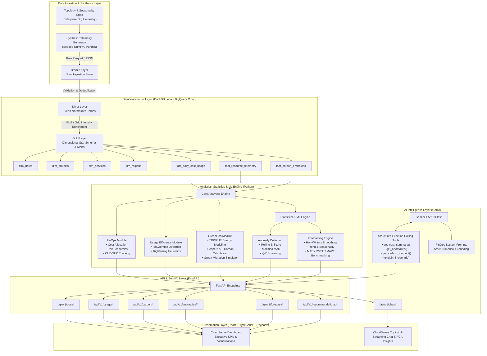
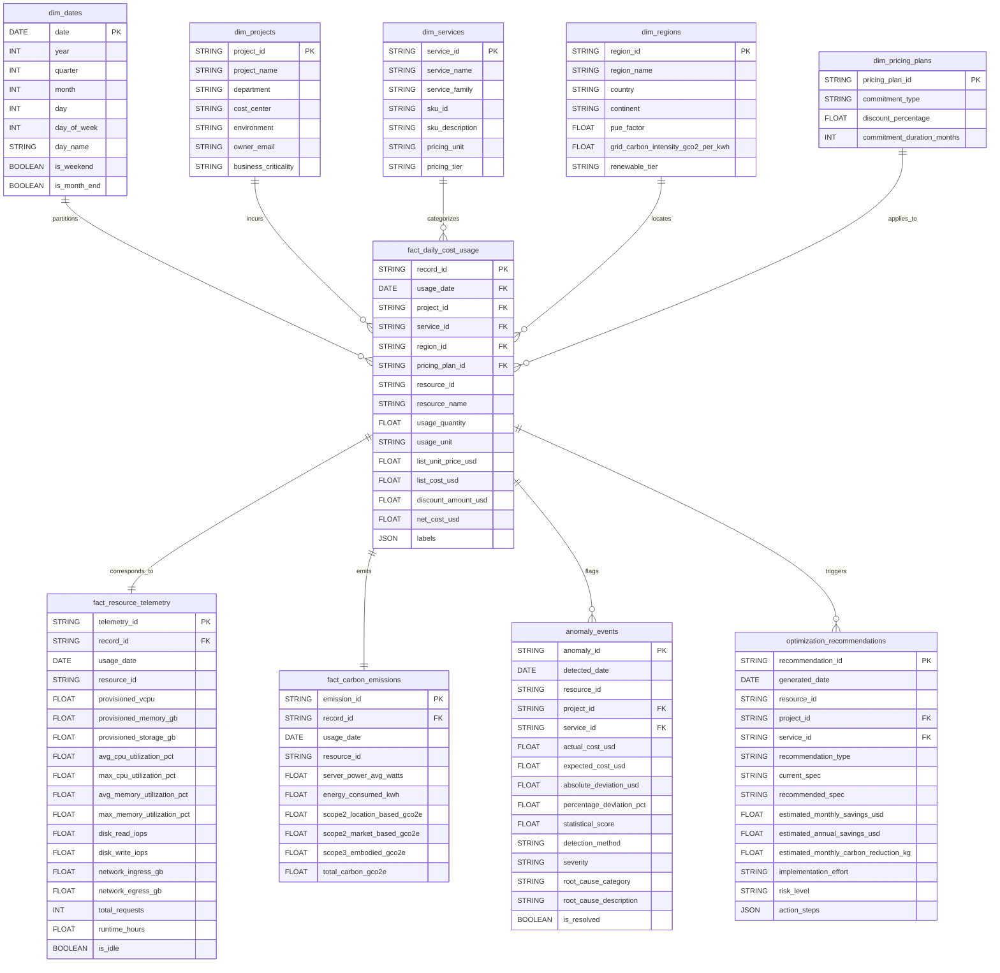
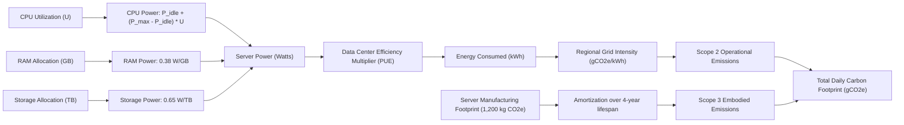
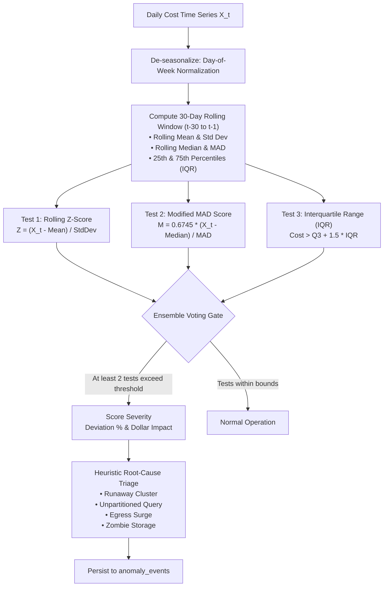
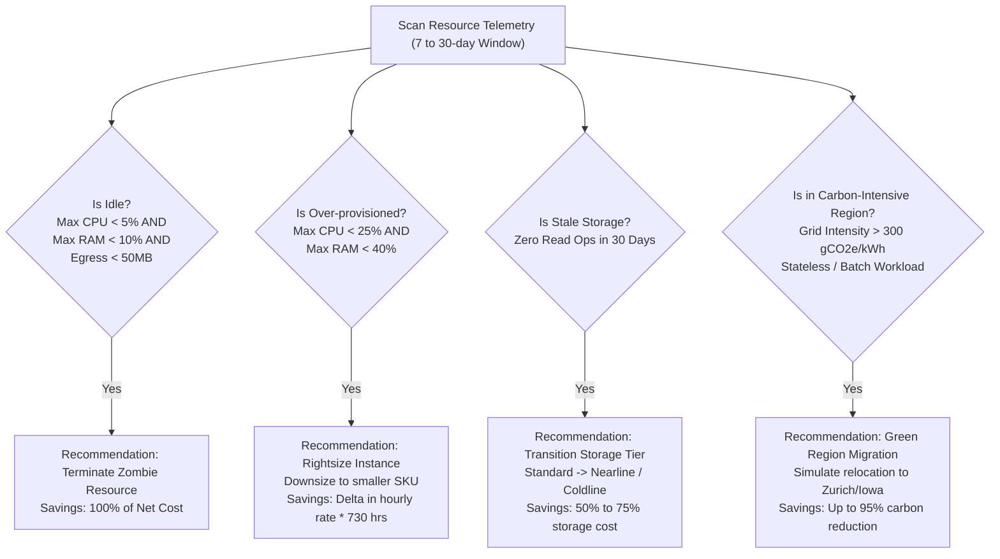
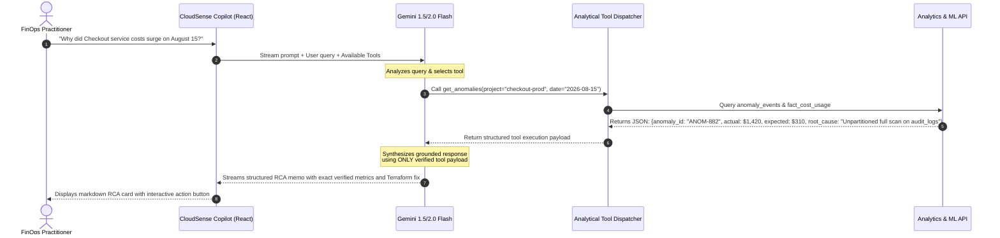
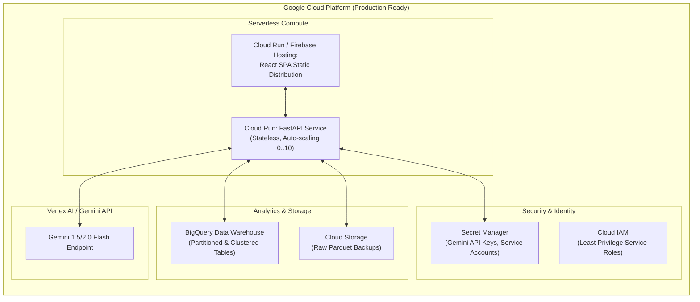
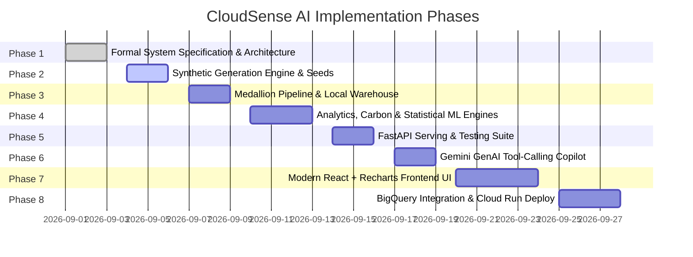

# CloudSense AI — System Architecture & Data Analytics Specification
**Platform**: Cloud Cost, Usage & Carbon Intelligence Platform  
**Target Tech Stack**: React + TypeScript + Tailwind + Recharts | Python + FastAPI | Pandas + NumPy + scikit-learn | BigQuery | Gemini 1.5/2.0 Flash | Cloud Run  
**Document Version**: 1.0.0 (Production Blueprint)  
**Status**: Formal Source of Truth  

---

## 1. Executive Summary & Design Principles

CloudSense AI is an enterprise-grade cloud intelligence platform that unifies **FinOps (Financial Operations)**, **Resource Efficiency (Utilization)**, and **GreenOps (Carbon Accounting)**. It bridges infrastructure monitoring, cost attribution, predictive modeling, and conversational AI into a cohesive analytical framework.

### Core Architectural Principles
1. **Analytically Derived Economics**: All costs and usage metrics are derived using explicit, configurable pricing rate cards and real-world billing mechanisms (provisioned vs. consumed). No ungrounded, arbitrary random numbers.
2. **Deterministic-to-Stochastic Resource Coupling**: Resource utilization (CPU %, RAM %, IOPS, Egress GB, Requests) directly informs power consumption and cost calculations.
3. **Interpretable Statistical Foundations**: Anomaly detection and forecasting prioritize transparent, explainable mathematics (Rolling Z-Scores, Modified MAD, IQR, Holt-Winters Exponential Smoothing) before evaluating complex ML models.
4. **Transparent Carbon Modeling**: Carbon emissions are strictly qualified as **Engineering Estimates** derived from the Cloud Carbon Footprint (CCF) standard and the GHG Protocol Corporate Standard (Scope 2 Location-Based and Scope 3 Embodied).
5. **Grounded AI (No Numerical Hallucination)**: Generative AI (Gemini) acts solely as an analytical reasoning and narrative synthesis layer. Gemini queries pre-computed analytical results via Tool Calling and explains findings without generating raw numerical metrics.
6. **Modularity & Reproducibility**: Seeded synthetic generators, pure-function analytical engines, and decoupled data layers guarantee deterministic testability across environments.

---

## 2. End-to-End System Architecture



---

## 3. Data Flow Architecture

The data lifecycle follows an automated **Medallion Pipeline**:

1. **Generation / Ingestion (Bronze)**:
   - Hourly and daily batch emission of raw billing line items and monitoring telemetry.
   - Schema mimics GCP Cloud Billing Export (`gcp_billing_export_resource_v1`) and Cloud Monitoring time-series exports.
2. **Cleaning, Normalization & Enrichment (Silver)**:
   - Currency standardization to USD.
   - Resource label unpacking (`environment`, `department`, `owner`, `cost_center`).
   - Imputation of metric gaps and validation of physical bounds ($0\% \le \text{CPU} \le 100\%$, $\text{RAM} \ge 0$).
   - Association with static hardware reference specifications (SPECpower CPU TDP benchmarks, memory wattage, disk wattage).
3. **Dimensional Aggregation & Modeling (Gold)**:
   - Conformed Star Schema creation.
   - Energy consumption (kWh) and GHG emissions ($\text{gCO}_2\text{e}$) calculated at the resource-day grain.
   - Daily dimensional rollups (`agg_daily_cost_service`, `agg_carbon_footprint_regional`, `agg_resource_utilization`).
4. **Feature & Analytical Serving**:
   - Feature engineering for time-series forecasting (lags, rolling averages, calendar encodings).
   - In-memory cache or fast analytical querying via DuckDB / BigQuery.
5. **Consumption**:
   - FastAPI analytical endpoints deliver structured JSON to the React dashboard and serve as tool-call targets for Gemini.

---

## 4. Comprehensive Data Warehouse Schema (BigQuery Optimized)

### Star Schema Entity-Relationship Diagram



### BigQuery Physical Optimization
1. **Partitioning**: All fact tables (`fact_daily_cost_usage`, `fact_resource_telemetry`, `fact_carbon_emissions`) are partitioned by `usage_date` (Day).
2. **Clustering**:
   - `fact_daily_cost_usage` clustered by `(project_id, service_id, region_id)`.
   - `fact_resource_telemetry` clustered by `(resource_id, usage_date)`.
   - `anomaly_events` clustered by `(detected_date, severity)`.
3. **Materialized Views**: Pre-computed daily rollups for the dashboard:
   - `mv_daily_cost_by_project`
   - `mv_daily_carbon_by_region`
   - `mv_weekly_utilization_summary`

---

## 5. Data Dictionary

### Table: `dim_projects`
| Field Name | Type | Nullable | Constraints / Allowed Values | Description |
|---|---|---|---|---|
| `project_id` | STRING | NO | Primary Key (e.g., `proj-checkout-prod`) | Unique project identifier |
| `project_name` | STRING | NO | Non-empty | Human-readable project name |
| `department` | STRING | NO | `Engineering`, `Data & AI`, `Product`, `Operations` | Organizational business unit |
| `cost_center` | STRING | NO | Format: `CC-[0-9]{4}` | Accounting cost center code |
| `environment` | STRING | NO | `production`, `staging`, `development`, `sandbox` | Deployment tier |
| `owner_email` | STRING | NO | Valid email format | Lead engineer / budget owner |
| `business_criticality`| STRING | NO | `Tier-1`, `Tier-2`, `Tier-3` | SLA criticality classification |

### Table: `dim_services`
| Field Name | Type | Nullable | Constraints / Allowed Values | Description |
|---|---|---|---|---|
| `service_id` | STRING | NO | Primary Key (e.g., `compute-engine-vm`) | Unique service identifier |
| `service_name` | STRING | NO | Non-empty | Service display name |
| `service_family` | STRING | NO | `Compute`, `Storage`, `Database`, `Networking`, `Serverless`, `Analytics` | High-level taxonomy |
| `sku_id` | STRING | NO | Standard SKU code | Provider SKU reference |
| `sku_description`| STRING | NO | Text | Detailed SKU description |
| `pricing_unit` | STRING | NO | `hour`, `gib-month`, `request-million`, `tb-scanned`, `gib-transfer` | Standard billing unit |
| `pricing_tier` | STRING | NO | `Standard`, `Premium`, `Coldline`, `Archive` | Operational performance tier |

### Table: `dim_regions`
| Field Name | Type | Nullable | Constraints / Allowed Values | Description |
|---|---|---|---|---|
| `region_id` | STRING | NO | Primary Key (e.g., `us-central1`) | Cloud region identifier |
| `region_name` | STRING | NO | Non-empty (e.g., `Iowa, USA`) | Geographic location |
| `country` | STRING | NO | ISO 3166-1 alpha-2 | Host country code |
| `pue_factor` | FLOAT | NO | $1.00 \le \text{PUE} \le 2.00$ | Facility Power Usage Effectiveness |
| `grid_carbon_intensity_gco2_per_kwh` | FLOAT | NO | $\ge 0.0$ | Regional electrical grid carbon intensity |
| `renewable_tier` | STRING | NO | `High (>80%)`, `Moderate (40-80%)`, `Low (<40%)` | Clean energy availability tier |

### Table: `fact_daily_cost_usage`
| Field Name | Type | Nullable | Constraints / Allowed Values | Description |
|---|---|---|---|---|
| `record_id` | STRING | NO | Primary Key (UUIDv4) | Unique billing line-item identifier |
| `usage_date` | DATE | NO | YYYY-MM-DD | Date of incurred usage |
| `project_id` | STRING | NO | Foreign Key $\to$ `dim_projects` | Attributed project |
| `service_id` | STRING | NO | Foreign Key $\to$ `dim_services` | Billed cloud service |
| `region_id` | STRING | NO | Foreign Key $\to$ `dim_regions` | Provisioned region |
| `pricing_plan_id` | STRING | NO | Foreign Key $\to$ `dim_pricing_plans` | Active commercial agreement |
| `resource_id` | STRING | NO | Non-empty URI or identifier | Cloud resource identifier |
| `resource_name` | STRING | NO | Non-empty | User-assigned resource name |
| `usage_quantity` | FLOAT | NO | $\ge 0.0$ | Volume consumed in `usage_unit` |
| `usage_unit` | STRING | NO | Matches `dim_services.pricing_unit` | Unit of measure |
| `list_unit_price_usd` | FLOAT | NO | $\ge 0.0$ | Catalog price per unit |
| `list_cost_usd` | FLOAT | NO | $\text{usage\_quantity} \times \text{list\_unit\_price}$ | Gross undiscounted spend |
| `discount_amount_usd` | FLOAT | NO | $\ge 0.0$ | CUD/SUD or negotiable credit discount |
| `net_cost_usd` | FLOAT | NO | $\text{list\_cost} - \text{discount\_amount}$ | Final invoice cost |
| `labels` | JSON | YES | Valid JSON key-value map | Custom resource metadata tags |

### Table: `fact_resource_telemetry`
| Field Name | Type | Nullable | Constraints / Allowed Values | Description |
|---|---|---|---|---|
| `telemetry_id` | STRING | NO | Primary Key (UUIDv4) | Unique telemetry observation key |
| `record_id` | STRING | NO | Foreign Key $\to$ `fact_daily_cost_usage` | Associated billing line item |
| `usage_date` | DATE | NO | YYYY-MM-DD | Observation date |
| `resource_id` | STRING | NO | Non-empty | Resource identifier |
| `provisioned_vcpu` | FLOAT | NO | $\ge 0.0$ | Assigned virtual CPU cores |
| `provisioned_memory_gb` | FLOAT | NO | $\ge 0.0$ | Assigned RAM in gigabytes |
| `provisioned_storage_gb` | FLOAT | NO | $\ge 0.0$ | Attached storage volume in gigabytes |
| `avg_cpu_utilization_pct` | FLOAT | NO | $0.0 \le \text{val} \le 100.0$ | 24-hour mean CPU utilization |
| `max_cpu_utilization_pct` | FLOAT | NO | $0.0 \le \text{val} \le 100.0$ | Peak observed CPU spike |
| `avg_memory_utilization_pct`| FLOAT | NO | $0.0 \le \text{val} \le 100.0$ | 24-hour mean RAM utilization |
| `max_memory_utilization_pct`| FLOAT | NO | $0.0 \le \text{val} \le 100.0$ | Peak observed RAM spike |
| `disk_read_iops` | FLOAT | NO | $\ge 0.0$ | Average read operations / sec |
| `disk_write_iops` | FLOAT | NO | $\ge 0.0$ | Average write operations / sec |
| `network_ingress_gb` | FLOAT | NO | $\ge 0.0$ | Inbound network transfer (GB) |
| `network_egress_gb` | FLOAT | NO | $\ge 0.0$ | Outbound network transfer (GB) |
| `total_requests` | INT | NO | $\ge 0$ | Total HTTP / RPC transactions |
| `runtime_hours` | FLOAT | NO | $0.0 \le \text{val} \le 24.0$ | Active operational hours in the day |
| `is_idle` | BOOLEAN | NO | `TRUE` or `FALSE` | Flagged based on idle heuristics |

### Table: `fact_carbon_emissions`
| Field Name | Type | Nullable | Constraints / Allowed Values | Description |
|---|---|---|---|---|
| `emission_id` | STRING | NO | Primary Key (UUIDv4) | Unique carbon measurement key |
| `record_id` | STRING | NO | Foreign Key $\to$ `fact_daily_cost_usage` | Associated billing line item |
| `usage_date` | DATE | NO | YYYY-MM-DD | Emission date |
| `resource_id` | STRING | NO | Non-empty | Resource identifier |
| `server_power_avg_watts`| FLOAT | NO | $\ge 0.0$ | Computed average power draw (W) |
| `energy_consumed_kwh` | FLOAT | NO | $\ge 0.0$ | Total energy consumed including PUE |
| `scope2_location_based_gco2e` | FLOAT | NO | $\ge 0.0$ | Operational emissions via grid factor |
| `scope2_market_based_gco2e` | FLOAT | NO | $\ge 0.0$ | Residual emissions after RECs |
| `scope3_embodied_gco2e` | FLOAT | NO | $\ge 0.0$ | Amortized hardware manufacturing footprint |
| `total_carbon_gco2e` | FLOAT | NO | $\text{Scope 2} + \text{Scope 3}$ | Total daily greenhouse gas footprint |

---

## 6. Mathematical & Statistical Methodology

### 6.1 Cost Analytics & Utilization Coupling

Billing mechanics are rigorously separated into **Provisioned Models** and **Consumption Models**:

#### A. Provisioned Resources (Compute Engine, GKE Nodes, Cloud SQL)
Financial cost is committed upfront, independent of actual utilization:
$$\text{Cost}_{\text{provisioned}} = \text{Runtime Hours} \times \left( \sum_{i} \text{Allocation}_i \times \text{Rate}_i \right) \times (1 - \text{Discount}_{\text{plan}})$$
Where:
- $\text{Allocation}_{\text{vcpu}} \times \text{Rate}_{\text{vcpu}}$ (e.g., \$0.0316 per vCPU-hr)
- $\text{Allocation}_{\text{ram\_gb}} \times \text{Rate}_{\text{ram}}$ (e.g., \$0.0042 per GB-hr)
- $\text{Allocation}_{\text{disk\_gb}} \times \text{Rate}_{\text{storage\_tier}}$

#### B. Consumption-Based Resources (Cloud Run, BigQuery, Network Egress)
Cost directly tracks operational demand:
$$\text{Cost}_{\text{serverless}} = (\text{vCPU-Seconds} \times R_{\text{vcpu\_sec}}) + (\text{GiB-Seconds} \times R_{\text{gib\_sec}}) + (\text{Requests} \times R_{\text{req}})$$
$$\text{Cost}_{\text{bigquery}} = \text{TB Scanned} \times \$6.25/\text{TB}$$
$$\text{Cost}_{\text{egress}} = \text{Egress}_{\text{GB}} \times R_{\text{egress\_tier}}(\text{Source}, \text{Destination})$$

---

### 6.2 Carbon & Energy Estimation Methodology

All environmental calculations are explicitly designated as **Estimates** adhering to the Cloud Carbon Footprint (CCF) open methodology and GHG Protocol guidelines.



#### Step 1: Server Power Consumption (SPECpower Benchmark)
$$P_{\text{server}} = P_{\text{idle}} + (P_{\text{max}} - P_{\text{idle}}) \times U_{\text{cpu}} + (P_{\text{ram}} \times \text{RAM}_{\text{GB}}) + (P_{\text{disk}} \times \text{Disk}_{\text{TB}})$$

*Engineered Physical Constants*:
- $P_{\text{idle}} = 12.50 \text{ W per vCPU}$ (Server baseline standby power)
- $P_{\text{max}} = 35.00 \text{ W per vCPU}$ (Full compute saturation)
- $P_{\text{ram}} = 0.38 \text{ W per GiB}$
- $P_{\text{disk\_ssd}} = 1.20 \text{ W per TB}$
- $P_{\text{disk\_hdd}} = 0.65 \text{ W per TB}$
- $U_{\text{cpu}} \in [0.0, 1.0]$: Average daily CPU utilization fraction

#### Step 2: Total Facility Energy (Including Cooling & Power Loss)
$$E_{\text{facility}} (\text{kWh}) = \frac{P_{\text{server}} \times \text{PUE}(\text{Region})}{1000} \times \text{Runtime Hours}$$
- $\text{PUE}(\text{Google Data Centers}) = 1.10$
- $\text{PUE}(\text{Generic Cloud Standard}) = 1.20$
- $\text{PUE}(\text{On-Premises Benchmark}) = 1.58$

#### Step 3: Scope 2 Operational Greenhouse Gas Emissions
$$\text{Carbon}_{\text{scope2}} (\text{gCO}_2\text{e}) = E_{\text{facility}} (\text{kWh}) \times I_{\text{grid}}(\text{Region})$$

*Regional Grid Emission Factors ($I_{\text{grid}}$ in $\text{gCO}_2\text{e/kWh}$)*:
- `europe-west6` (Zurich, Switzerland): **$15.30 \text{ gCO}_2\text{e/kWh}$** (Hydro/Nuclear)
- `us-central1` (Iowa, USA): **$132.00 \text{ gCO}_2\text{e/kWh}$** (High Wind)
- `europe-west1` (St. Ghislain, Belgium): **$167.00 \text{ gCO}_2\text{e/kWh}$**
- `us-east4` (Northern Virginia, USA): **$339.00 \text{ gCO}_2\text{e/kWh}$** (PJM Interconnection)
- `asia-south1` (Mumbai, India): **$712.00 \text{ gCO}_2\text{e/kWh}$** (Coal-dominant grid)

#### Step 4: Scope 3 Embodied Emissions (Manufacturing & Amortization)
Hardware manufacturing emits substantial greenhouse gases before the server is ever powered on:
$$\text{Carbon}_{\text{scope3}} (\text{gCO}_2\text{e}) = \left( \frac{\text{Embodied}_{\text{server}}}{\text{Lifespan}_{\text{hours}}} \right) \times \left( \frac{\text{vCPU}_{\text{allocated}}}{\text{vCPU}_{\text{total\_chassis}}} \right) \times \text{Runtime Hours}$$
- $\text{Embodied}_{\text{server}} = 1,200,000 \text{ gCO}_2\text{e}$ ($1,200 \text{ kg CO}_2\text{e}$ for a standard 2U 128-vCPU server).
- $\text{Lifespan}_{\text{hours}} = 4 \text{ years} \times 365.25 \times 24 = 35,064 \text{ hours}$.
- Amortized hourly baseline: $\approx 0.267 \text{ gCO}_2\text{e per vCPU-hour}$.

---

### 6.3 Anomaly Detection Methodology

Rather than arbitrary flags, anomalies are detected using a **multi-tiered, interpretable statistical screening process**:



#### 1. Rolling Median Absolute Deviation (MAD) — Primary Outlier Gate
MAD is robust against historical outliers that distort traditional standard deviations:
$$\text{Median}_t = \text{median}(X_{t-W}, \dots, X_{t-1})$$
$$\text{MAD}_t = \text{median}(|X_i - \text{Median}_t|) \quad \text{for } i \in [t-W, t-1]$$
$$\text{Modified Z-score } M_t = \frac{0.6745 \times (X_t - \text{Median}_t)}{\max(\text{MAD}_t, \epsilon)}$$
- Flagged if $|M_t| \ge 3.5$ (Extreme Deviation).

#### 2. Rolling Z-Score with Day-of-Week Baseline
To account for standard weekly cycles:
$$Z_t = \frac{X_t - \mu_{t, \text{dow}}}{\sigma_{t, \text{dow}}}$$
- Flagged if $Z_t \ge 3.0$ and absolute dollar deviation $\Delta \text{Cost} \ge \$50.00$.

#### 3. Interquartile Range (IQR) Fences
$$\text{IQR}_t = Q_3(X_{t-W:t-1}) - Q_1(X_{t-W:t-1})$$
$$\text{Upper Fence} = Q_3 + 1.5 \times \text{IQR}_t$$
$$\text{Extreme Fence} = Q_3 + 3.0 \times \text{IQR}_t$$

#### Severity Classification Matrix
- **Low**: Deviation $+25\%$ to $+50\%$ and $\Delta \text{Cost} \ge \$50$.
- **Medium**: Deviation $+50\%$ to $+150\%$ and $\Delta \text{Cost} \ge \$150$.
- **High**: Deviation $+150\%$ to $+300\%$ and $\Delta \text{Cost} \ge \$500$.
- **Critical**: Deviation $> +300\%$ or single-day unbudgeted surge $\ge \$1,000$.

---

### 6.4 Cost Forecasting Methodology

Forecasting projects 30, 60, and 90-day expenditures while benchmarking an **interpretable statistical baseline** against an **ML regressor**:

#### A. Baseline Model: Holt-Winters Additive & Multiplicative Exponential Smoothing
Captures baseline spend level ($l_t$), organic growth trend ($b_t$), and 7-day weekly seasonality ($s_t$):
$$\hat{y}_{t+h} = l_t + h b_t + s_{t + h - m(k+1)}$$
Updating equations:
$$l_t = \alpha (y_t - s_{t-m}) + (1 - \alpha)(l_{t-1} + b_{t-1})$$
$$b_t = \beta (l_t - l_{t-1}) + (1 - \beta)b_{t-1}$$
$$s_t = \gamma (y_t - l_t) + (1 - \gamma)s_{t-m}$$
Where $m = 7$ (weekly seasonality cycle), and $\alpha, \beta, \gamma \in [0, 1]$ are optimized via bounded L-BFGS-B minimizing training RMSE.

#### B. Benchmark ML Model: Regularized Ridge Regression with Lagged Features
Feature Matrix $X_t$:
- **Autoregressive Lags**: $y_{t-1}, y_{t-2}, y_{t-7}, y_{t-14}, y_{t-30}$
- **Rolling Windows**: 7-day rolling mean, 14-day rolling standard deviation
- **Calendar Encodings**: Day of week (One-Hot), Day of month (Sine/Cosine cyclic transform), Is Month-End (Boolean)
- **Objective Function**:
  $$\min_w \|Xw - y\|_2^2 + \lambda \|w\|_2^2$$

#### C. Evaluation Metrics (Strict Out-of-Sample Validation)
Both models are evaluated on a 30-day holdout test horizon:
1. **Mean Absolute Error (MAE)**:
   $$\text{MAE} = \frac{1}{n} \sum_{t=1}^n |y_t - \hat{y}_t|$$
2. **Root Mean Squared Error (RMSE)**:
   $$\text{RMSE} = \sqrt{\frac{1}{n} \sum_{t=1}^n (y_t - \hat{y}_t)^2}$$
3. **Mean Absolute Percentage Error (MAPE)**:
   $$\text{MAPE} = \frac{100\%}{n} \sum_{t=1}^n \left| \frac{y_t - \hat{y}_t}{y_t} \right|$$

---

### 6.5 Optimization & Savings Calculations

Recommendations are evaluated using strict, deterministic financial rules with both monthly and annual ROI:



#### Savings Formulas:
- **Monthly Compute Savings**:
  $$\text{Savings}_{\text{monthly}} = (\text{HourlyRate}_{\text{current}} - \text{HourlyRate}_{\text{recommended}}) \times 730 \text{ hours} \times (1 - \text{Discount}_{\text{plan}})$$
- **Annual Savings**:
  $$\text{Savings}_{\text{annual}} = \text{Savings}_{\text{monthly}} \times 12$$
- **Carbon Reduction**:
  $$\Delta \text{Carbon}_{\text{monthly}} (\text{kg CO}_2\text{e}) = \frac{\Delta \text{Energy}_{\text{facility}} (\text{kWh/month}) \times I_{\text{grid}}}{1000}$$

---

## 7. AI Analyst Architecture (Gemini Grounding & Tool-Calling)

### Zero-Hallucination Guardrail Architecture
The Gemini AI layer is strictly configured as an **Analytical Reasoning Agent**. It does not perform mathematical aggregations directly. It requests verified facts through a typed **Tool-Calling Interface** and generates human-readable explanations, summaries, and remediations.



### Registered Gemini Tool Interfaces:
1. `get_cost_summary(start_date, end_date, group_by)`
2. `get_anomalies(start_date, end_date, severity_threshold)`
3. `get_optimization_recommendations(category, min_savings)`
4. `get_carbon_footprint(start_date, end_date, region_id)`
5. `explain_anomaly_incident(anomaly_id)`

---

## 8. API Architecture (FastAPI)

All endpoints follow RESTful design, provide typed Pydantic responses, and document OpenAPI 3.1 schemas.

### Route Matrix
| Endpoint | Method | Purpose | Key Parameters |
|---|---|---|---|
| `/api/v1/cost/summary` | GET | Aggregated cost rollups | `start_date`, `end_date`, `group_by` |
| `/api/v1/cost/unit-economics` | GET | Cost per user / per request | `project_id`, `metric` |
| `/api/v1/usage/idle-resources` | GET | Inventory of idle & zombie assets | `min_idle_days`, `department` |
| `/api/v1/carbon/footprint` | GET | Scope 2 & 3 emissions breakdown | `start_date`, `end_date`, `region_id` |
| `/api/v1/carbon/simulate-migration` | POST | Green migration carbon delta | `workload_id`, `target_region` |
| `/api/v1/anomalies/active` | GET | Detected cost & usage anomalies | `severity`, `status` |
| `/api/v1/anomalies/{id}/rca` | GET | Root cause diagnostic payload | `anomaly_id` |
| `/api/v1/forecast/project` | GET | 30/60/90 day cost projection | `horizon_days`, `model_type` |
| `/api/v1/recommendations/list` | GET | Prioritized savings recommendations | `category`, `min_annual_savings` |
| `/api/v1/chat/completions` | POST | Streaming Gemini Copilot dialogue | `message`, `conversation_history` |

---

## 9. Frontend Architecture (React + TypeScript + Recharts)

### Dashboard Layout & Component Hierarchy
```
AppLayout
├── TopNavigationBar (Environment selector, Date range picker, Currency switch)
├── ExecutiveKpiBanner
│   ├── TotalSpendCard (Spend to date, MoM %, Budget burn rate)
│   ├── TotalCarbonCard (Total kg CO2e, Scope 2/3 ratio, Green Region %)
│   ├── ActiveAnomaliesCard (Unresolved incident count, Dollar impact)
│   └── OptimizationPotentialCard (Available annual savings, Quick-win count)
├── MainAnalyticsTabs
│   ├── Tab 1: FinOps & Cost Allocation (Stacked Area Chart, Waterfall breakdown)
│   ├── Tab 2: Resource Utilization & Rightsizing (CPU/RAM distribution scatter, Idle table)
│   ├── Tab 3: GreenOps & Carbon Intelligence (Regional heat map, Emission trend, Migration simulator)
│   ├── Tab 4: Anomaly Detection & Incidents (Timeline chart, Incident RCA drawer)
│   └── Tab 5: Cost Forecasting & Budget Planning (Historical + Projected confidence cone)
└── CloudSenseCopilotDrawer
    ├── MessageStream (Markdown rendered, KaTeX math supported)
    ├── ToolExecutionBadges (Displays live analytical tools invoked by Gemini)
    └── QuickActionPrompts ("Explain top anomaly", "Show me quick carbon wins")
```

---

## 10. Testing & Data Quality Strategy

1. **Data Consistency & Range Invariants**:
   - $\text{Net Cost} \ge 0.0$ and $\text{Net Cost} \le \text{List Cost}$.
   - $0.0 \le \text{avg\_cpu\_utilization\_pct} \le \text{max\_cpu\_utilization\_pct} \le 100.0$.
   - $\text{Total Carbon} = \text{Scope 2} + \text{Scope 3}$.
2. **Unit Testing**:
   - Exact mathematical assertion of PUE, TDP, and Scope 2/3 formulas against hand-calculated benchmarks.
   - Deterministic verification of Rolling Z-Score and MAD outputs.
   - Evaluation metric unit tests (MAE, RMSE, MAPE).
3. **Reproducibility Test**:
   - Invariant check that running the synthetic data generator with seed `42` yields bitwise identical Parquet datasets across operating systems.

---

## 11. Deployment Architecture (Google Cloud Platform)



---

## 12. Project Directory Structure

```
CloudSense-AI/
├── .github/
│   └── workflows/
│       └── ci.yml                        # Automated testing & linting pipeline
├── docs/
│   ├── cloudsense_system_specification.md# This formal source of truth document
│   └── architecture_diagrams.md          # Additional diagrams & slide assets
├── data/
│   ├── raw/                              # Bronze layer: Raw generated Parquet files
│   ├── processed/                        # Silver layer: Clean normalized data
│   └── marts/                            # Gold layer: Dimensional tables & aggregated marts
├── src/
│   ├── __init__.py
│   ├── generator/                        # Synthetic Data Generation Engine
│   │   ├── __init__.py
│   │   ├── config.py                     # Catalog specifications, regions, pricing rates
│   │   ├── generator.py                  # Core deterministic generation pipeline (Seeded)
│   │   └── anomalies.py                  # Injector of realistic FinOps incident scenarios
│   ├── pipeline/                         # Medallion ETL & Warehouse Pipeline
│   │   ├── __init__.py
│   │   ├── schema.py                     # Pydantic schemas for all entities
│   │   ├── etl.py                        # Bronze -> Silver -> Gold transformation logic
│   │   └── warehouse.py                  # Abstract adapter (DuckDB local / BigQuery cloud)
│   ├── analytics/                        # Pure Analytical Engines
│   │   ├── __init__.py
│   │   ├── cost_analyzer.py              # Attribution, unit economics, CUD coverage
│   │   ├── usage_analyzer.py             # Idle scoring, zombie resource discovery
│   │   └── carbon_calculator.py          # SPECpower TDP, PUE, Scope 2/3 GHG math
│   ├── ml/                               # Statistical & ML Modeling
│   │   ├── __init__.py
│   │   ├── anomaly_detector.py           # Rolling Z-Score, Modified MAD, IQR fences
│   │   ├── forecaster.py                 # Holt-Winters & Ridge time-series forecaster
│   │   └── optimizer.py                  # Rightsizing & storage transition recommender
│   ├── ai/                               # Gemini Grounded Intelligence Layer
│   │   ├── __init__.py
│   │   ├── client.py                     # Gemini SDK client with retry & rate limiting
│   │   ├── tools.py                      # Strongly typed tool definitions for function calling
│   │   └── prompts.py                    # Zero-hallucination FinOps prompt engineering
│   └── api/                              # FastAPI Backend
│       ├── __init__.py
│       ├── main.py                       # FastAPI application factory & middleware
│       ├── dependencies.py               # Dependency injection (Warehouse, Analyzers)
│       └── routers/                      # Dedicated endpoint routers
│           ├── cost.py
│           ├── usage.py
│           ├── carbon.py
│           ├── anomalies.py
│           ├── forecast.py
│           ├── recommendations.py
│           └── chat.py
├── tests/                                # Comprehensive Pytest Suite
│   ├── test_generator.py                 # Tests reproducibility, schema compliance, distributions
│   ├── test_carbon_math.py               # Tests exact numerical carbon formulas
│   ├── test_anomaly_detection.py         # Tests Z-score, MAD, and incident detection
│   ├── test_forecasting.py               # Tests forecast horizons and MAE/RMSE calculation
│   └── test_api_routes.py                # Tests FastAPI endpoints & contracts
├── frontend/                             # React + TypeScript Web Application (Later phase)
├── Dockerfile                            # Production multi-stage container build
├── docker-compose.yml                    # Local multi-service orchestration
├── pyproject.toml                        # Modern Python project configuration
├── requirements.txt                      # Locked Python dependencies
└── README.md                             # Portfolio-grade repository documentation
```

---

## 13. Phased Implementation Roadmap



- **Phase 1: Architecture & Data Specification (Current)**: Lock the single source of truth document.
- **Phase 2: Synthetic Data Engine**: Develop reproducible generator with realistic enterprise topology, seasonality, pricing rate cards, and injected anomaly incidents.
- **Phase 3: Medallion Pipeline & Local Warehouse**: Implement Bronze $\to$ Silver $\to$ Gold transformation with DuckDB/Parquet storage and data validation assertions.
- **Phase 4: Analytics, Carbon & ML Engines**: Implement pure mathematical calculators for FinOps, GreenOps (TDP/PUE/Scope 2 & 3), anomaly detection (MAD/Z-Score/IQR), and cost forecasting (Holt-Winters).
- **Phase 5: FastAPI Backend & API Contracts**: Build high-performance async REST API endpoints exposing analytical data with full unit test coverage.
- **Phase 6: Gemini Copilot Integration**: Build the tool-dispatch agent using Gemini 1.5/2.0 Flash with zero numerical hallucinations.
- **Phase 7: React + TypeScript Frontend**: Develop the portfolio-grade UI with interactive Recharts visualizations, carbon gauges, and streaming copilot chat.
- **Phase 8: BigQuery & Cloud Run Deployment**: Add GCP BigQuery synchronization scripts and containerize for Google Cloud Run.
