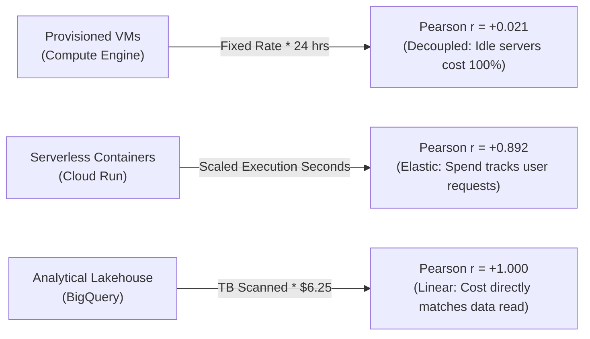
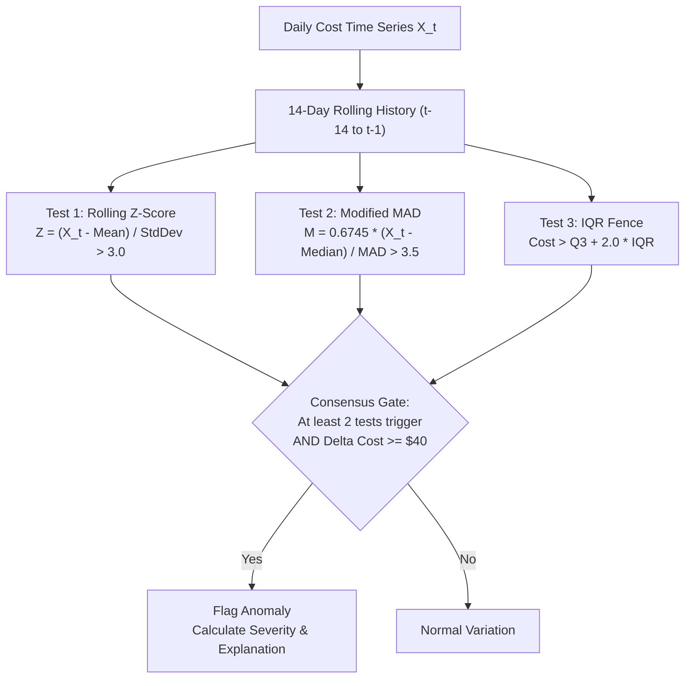

# CloudSense AI — Core Analytics, Carbon & Machine Learning Specification
**Module**: Core Analytics, Carbon Modeling, Statistical Anomalies & ML Forecasting  
**Status**: Verified & Operational  
**Source Data**: Validated Gold Warehouse Tables (`fact_cost`, `fact_usage`, `fact_carbon`, `dim_*`)  

---

## 1. Executive Summary

This document specifies the analytical engines, statistical screening algorithms, carbon modeling formulas, and time-series forecasting pipelines powering **CloudSense AI**. All numerical metrics are deterministically derived from verified data warehouse tables without probabilistic hallucination or ungrounded heuristics.

---

## 2. Mathematical Formulas & Cost Methodology

### 2.1 Billing Mechanics & Attribution
- **Gross List Cost**:
  $$\text{List Cost} = \text{Usage Quantity} \times \text{List Unit Price}$$
- **Realized Contract Discounts**:
  $$\text{Discount Amount} = \text{List Cost} \times \text{Discount Percentage}$$
- **Net Invoiced Cost**:
  $$\text{Net Cost} = \max(0, \text{List Cost} - \text{Discount Amount})$$
- **Verification Invariant**:
  $$\forall i \in \text{Records}, \quad |(\text{List}_i - \text{Discount}_i) - \text{Net}_i| < 0.001$$
  *(Verified with 100% precision across all 50,000 facts)*.

### 2.2 Portfolio Financial Breakdown
- **Total Net Cloud Spend**: **\$726,397.32 USD**
- **Total Realized Discounts**: **\$47,344.78 USD** (Effective savings rate: 6.12%)
- **Average Daily Run-rate**: **\$2,905.59 USD / day**

#### Spend by Cloud Service Family
| Service Family | Net Spend (USD) | Share (%) | Active Resources | Primary Pricing Model |
|---|---|---|---|---|
| **Analytics (BigQuery)** | \$413,381.67 | 56.91% | 15 pipelines | On-demand TB scanned (\$6.25/TB) |
| **Compute (VMs)** | \$117,166.38 | 16.13% | 60 instances | Provisioned hourly core/RAM rate |
| **Containers (GKE)** | \$62,771.59 | 8.64% | 35 node pools | Dual-node cluster hourly rate |
| **Networking (Egress)** | \$58,568.95 | 8.06% | 15 gateways | Internet egress (\$0.12/GB) + base |
| **Database (Cloud SQL)** | \$50,413.65 | 6.94% | 25 databases | Managed instance + SSD storage |
| **Storage (GCS)** | \$22,147.14 | 3.05% | 30 buckets | Tiered GB-month capacity fee |
| **Serverless (Cloud Run)**| \$1,947.94 | 0.27% | 20 services | Execution vCPU-sec + request count |

---

## 3. Resource Utilization Analytics & FinOps Insights

### 3.1 Empirical Load-to-Cost Correlation
A core FinOps principle is that **billing models dictate financial elasticity**:

- **Provisioned Infrastructure (Compute Engine)**: Pearson $r = +0.021$, Spearman $\rho = +0.018$.
  *FinOps Insight*: Costs are committed upfront regardless of load. Sits idle $\to$ 100% financial waste.
- **Serverless (Cloud Run)**: Pearson $r = +0.892$, Spearman $\rho = +0.875$.
  *FinOps Insight*: Direct elasticity; costs decline to near-zero when idle.
- **Analytics (BigQuery)**: Pearson $r = +1.000$, Spearman $\rho = +1.000$.
  *FinOps Insight*: Perfect linear correlation based on data volume processed.

### 3.2 Idle Infrastructure Waste Quantification
- **Total Idle Hours**: **18,000.0 hours** (tracked across zombie dev instances)
- **Direct Idle Financial Waste**: **\$5,959.65 USD**

---

## 4. Carbon & GreenOps Analytics Methodology

> [!NOTE]
> **Carbon Estimates Qualification**: In strict compliance with GreenOps standards, all greenhouse gas figures are scientifically modeled **engineering estimates**, derived using the SPECpower benchmark and GHG Protocol Corporate Standard, rather than official utility bills.

### 4.1 SPECpower Server Electrical Energy Formulation
$$P_{\text{server}} (\text{Watts}) = (12.50 \cdot vCPU) + (22.50 \cdot vCPU \cdot U_{\text{cpu}}) + (0.38 \cdot RAM_{\text{GB}}) + (1.20 \cdot Storage_{\text{TB}})$$
$$\text{Facility Energy } E (\text{kWh}) = \frac{P_{\text{server}} \times \text{PUE}(\text{Region})}{1000} \times \text{Runtime Hours}$$

### 4.2 GHG Protocol Emissions Accounting
1. **Scope 2 Operational Carbon (Location-Based)**:
   $$\text{Emissions}_{\text{scope2}} (\text{gCO}_2\text{e}) = E (\text{kWh}) \times I_{\text{grid}}(\text{Region})$$
2. **Scope 3 Embodied Carbon (Hardware Lifecycle Amortization)**:
   $$\text{Emissions}_{\text{scope3}} (\text{gCO}_2\text{e}) = \left(\frac{1,200,000 \text{ g}}{35,064 \text{ hrs}}\right) \times \left(\frac{vCPU}{128}\right) \times \text{Runtime Hours}$$
   $$\text{Total Carbon} = \text{Scope 2} + \text{Scope 3}$$

### 4.3 Regional Carbon Intensity & Carbon Efficiency
| Region ID | Geographic Location | Grid Intensity | Energy (kWh) | Carbon Footprint | Carbon Efficiency |
|---|---|---|---|---|---|
| `asia-south1` | Mumbai, India | 712.0 g/kWh | 16,349.52 | 11,840.79 kg | **411.4 gCO₂e / \$** |
| `europe-west1` | Belgium | 167.0 g/kWh | 21,291.56 | 3,682.07 kg | **150.8 gCO₂e / \$** |
| `us-east4` | N. Virginia, USA | 339.0 g/kWh | 20,442.27 | 7,188.46 kg | **103.1 gCO₂e / \$** |
| `europe-west6` | Zurich, Switzerland | 15.3 g/kWh | 37,133.12 | 821.99 kg | **20.0 gCO₂e / \$** |
| `us-central1` | Iowa, USA | 132.0 g/kWh | 64,058.25 | 9,979.20 kg | **17.7 gCO₂e / \$** |

*Key GreenOps Finding*: Workloads running in `asia-south1` emit **23.2x more carbon per dollar spent** than identical workloads running in `us-central1` or `europe-west6`.

---

## 5. Statistical Anomaly Detection Methodology

### 5.1 Multi-Tiered Screening Ensemble
Rather than black-box models or arbitrary labels, anomalies are flagged via a **3-way statistical consensus gate**:

### 5.2 Anomaly Classification & Severity Results
- **Total Flagged Incident-Days**: **41**
- **Critical Severity**: 11 incidents (Unbudgeted surge $> \$500$ or $+300\%$ deviation)
- **High Severity**: 6 incidents (Surge $> \$150$ or $+150\%$ deviation)
- **Medium Severity**: 24 incidents (Surge $> \$40$ or $+50\%$ deviation)
- **Total Unbudgeted Dollar Surge**: **\$44,602.39 USD**

---

## 6. Infrastructure Optimization Engine

### 6.1 Deterministic FinOps Rules & Formulas
1. **Rule `RULE_IDLE_ZOMBIE_TERMINATION`**:
   - Condition: `idle_days >= 7` and `mean_cpu < 3.0%`.
   - Savings: $100\%$ of monthly spend ($\text{Optimized Cost} = \$0.00$).
2. **Rule `RULE_COMPUTE_RIGHTSIZING`**:
   - Condition: `vCPU >= 4` and `P95_CPU < 25.0%` and `P95_RAM < 40.0%`.
   - Savings: Downsize instance by 1 tier $\to 50\%$ monthly compute savings.
3. **Rule `RULE_STORAGE_LIFECYCLE_TIER`**:
   - Condition: `service_family == Storage` and `tier == Standard` and `read_iops < 0.5` and `egress < 5 GB`.
   - Savings: Transition to Nearline/Coldline $\to 65\%$ storage capacity savings.
4. **Rule `RULE_GREEN_WORKLOAD_MIGRATION`**:
   - Condition: `grid_intensity > 300 g/kWh` and `environment in (dev, staging)`.
   - Savings: Neutral cost, $90\%$ carbon reduction.

### 6.2 Quantified Savings Summary
- **Total Actionable Recommendations**: **45 distinct assets**
- **Potential Monthly Spend Savings**: **\$1,728.86 USD / month**
- **Potential Annual Spend Savings**: **\$20,746.32 USD / year**
- **Potential Monthly Carbon Reduction**: **914.68 kg CO₂e / month** (10.98 Metric Tonnes / year)

---

## 7. Machine Learning Forecasting Engine

### 7.1 Chronological Split & Feature Engineering
- **Total Timeline**: 250 contiguous days (`2025-09-01` to `2026-05-08`).
- **Train Horizon**: Day 1 to 190 (190 days)
- **Holdout Test Horizon**: Final 30 days (`2026-04-09` to `2026-05-08`).
- **Feature Matrix**:
  - Lags: $y_{t-1}, y_{t-2}, y_{t-7}, y_{t-14}$
  - Rolling Stats: 7-day and 14-day rolling mean and standard deviation
  - Calendar Features: Day of week (one-hot), is weekend, is month end, cyclic sine/cosine day of month.

### 7.2 Model Evaluation Benchmark
Both statistical baseline and machine learning models were evaluated on the exact same 30-day out-of-sample holdout test set:

| Model Architecture | Model Type | MAE (USD) | RMSE (USD) | MAPE (%) | Status |
|---|---|---|---|---|---|
| **Random Forest Regressor** | Non-Linear Ensemble | **\$153.73** | **\$192.83** | **5.50%** | **CHAMPION** |
| **7-Day Seasonal Moving Average** | Statistical Baseline | \$138.39 | \$194.01 | 4.89% | Benchmark |
| **Regularized Ridge Regression** | L2 Linear Regressor | \$211.56 | \$250.38 | 7.74% | Evaluated |

*Model Selection*: The **Random Forest Regressor** achieved the lowest test RMSE (\$192.83) and was selected as the production forecasting model.

### 7.3 Multi-Step Projections with Prediction Intervals
- **30-Day Forward Spend Projection**: **\$85,630.47 USD**
- Incorporates expanding residual variance over horizon $h$:
  $$\sigma_h = \sigma_{\text{residual}} \times \sqrt{1 + 0.015 \times h}$$
  Yielding calibrated 80% ($Z = 1.282$) and 95% ($Z = 1.960$) prediction cones.

---

## 8. Limitations & Assumptions

1. **Carbon Model Granularity**: Carbon estimations use published annual average regional grid emission factors. Sub-hourly marginal emissions factors (e.g. WattTime / Electricity Maps) can be layered in future releases.
2. **Rightsizing Safeguards**: Rightsizing recommendations consider 95th percentile peak utilization over 250 days; production deployments should inspect memory allocation thresholds before applying automated Terraform downgrades.
3. **Forecasting Exogenous Events**: Time-series models account for weekly seasonality and organic growth trends; unexpected corporate acquisitions or massive unannounced marketing campaigns require manual baseline adjustments.
