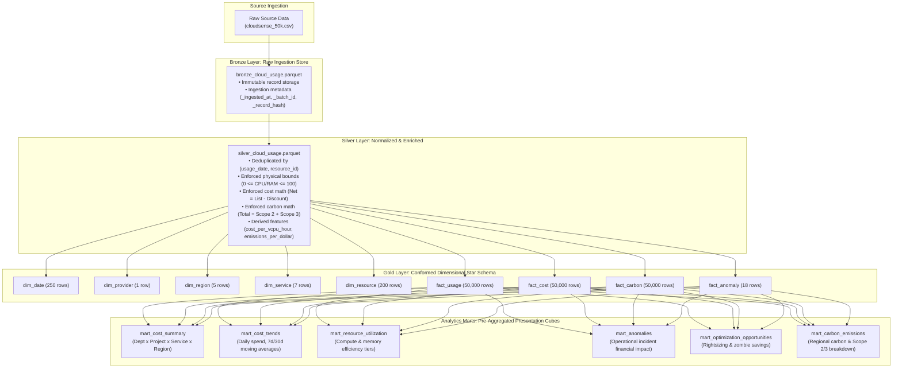
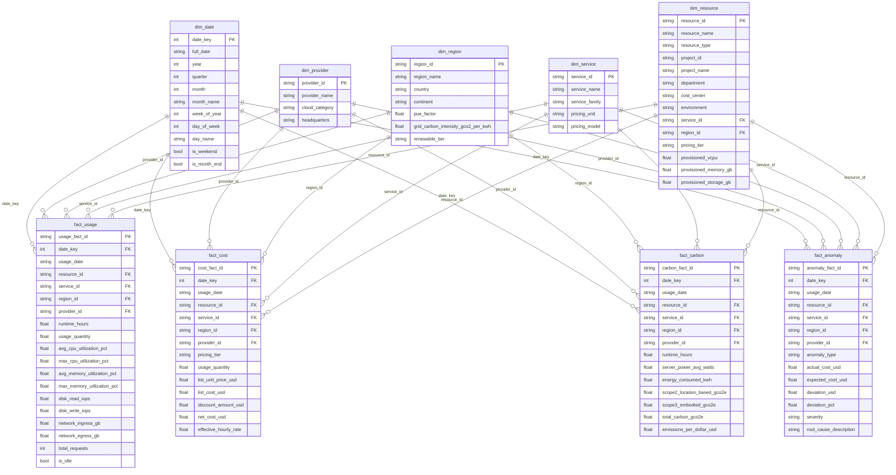

# CloudSense AI — Data Warehouse Architecture & Analytics Marts Specification
**Architecture Version**: 1.0.0  
**Warehouse Engine**: Local DuckDB (Parquet Storage) $\to$ Production Google BigQuery  
**Pipeline Pattern**: Medallion Architecture (Bronze $\to$ Silver $\to$ Gold $\to$ Marts)  
**Status**: Formal Source of Truth  

---

## 1. Executive Overview

This document defines the physical and logical data warehouse architecture for the **CloudSense AI** platform. It provides the implementation blueprint for data lineage, dimensional modeling, automated validation rules, presentation marts, and the future cloud migration strategy to Google BigQuery.

---

## 2. Medallion Architecture

---

## 3. Dimensional Star Schema & Table Definitions

### Entity-Relationship Diagram

---

## 4. Analytics Marts Specifications

| Mart Name | Storage File | Granularity | Key Aggregations & Metrics | Primary Use Case |
|---|---|---|---|---|
| `mart_cost_summary` | `mart_cost_summary.parquet` | Dept $\times$ Project $\times$ Service $\times$ Region | Total List Cost, Discounts, Net Cost, Daily Average, Active Resource Count | Executive KPI widgets, multi-dimensional slice-and-dice |
| `mart_cost_trends` | `mart_cost_trends.parquet` | Daily Date (250 Days) | Daily Net Spend, 7-Day Moving Avg, 30-Day Moving Avg, WoW Growth % | Time-series forecasting baseline, budget burn-rate tracking |
| `mart_resource_utilization` | `mart_resource_utilization.parquet` | Cloud Resource (200 Assets) | Mean CPU %, P95 Peak CPU %, Mean RAM %, P95 Peak RAM %, Idle Days Count, Classification Tier | Rightsizing engine, zombie identification |
| `mart_anomalies` | `mart_anomalies.parquet` | Incident Type $\times$ Severity | Incident Days Count, Affected Assets, Actual Spend, Expected Spend, Dollar Surge | Anomaly timeline, incident RCA drawer |
| `mart_optimization_opportunities` | `mart_optimization_opportunities.parquet` | Resource $\times$ Action Category | Current Monthly Run-rate, Est. Monthly Savings, Est. Annual Savings, Est. Monthly Carbon Saved | FinOps prioritization, quick-win action cards |
| `mart_carbon_emissions` | `mart_carbon_emissions.parquet` | Regional Data Center | Total Energy (kWh), Scope 2 Operational, Scope 3 Embodied, Carbon Intensity ($gCO_2e/\$$) | GreenOps dashboard, regional workload migration simulator |

---

## 5. Automated Data Quality & Validation Rules

The pipeline enforces 25 continuous integrity assertions executed by [`src/pipeline/validator.py`](file:///c:/Users/USER/Desktop/CloudSense-AI/src/pipeline/validator.py):

1. **Primary Key Uniqueness & Non-Nullness**:
   - `dim_date.date_key` (250 distinct dates)
   - `dim_provider.provider_id` (1 distinct provider: GCP)
   - `dim_region.region_id` (5 distinct regions)
   - `dim_service.service_id` (7 distinct services)
   - `dim_resource.resource_id` (200 distinct cloud assets)
   - `fact_usage.usage_fact_id` (50,000 distinct records)
   - `fact_cost.cost_fact_id` (50,000 distinct records)
   - `fact_carbon.carbon_fact_id` (50,000 distinct records)
   - `fact_anomaly.anomaly_fact_id` (18 distinct incidents)
2. **Referential Integrity (Foreign Keys)**:
   - 100% of foreign keys (`resource_id`, `service_id`, `region_id`, `date_key`, `provider_id`) across all fact tables match valid rows in their parent dimension tables. Zero orphan records.
3. **Physical & Utilization Invariants**:
   - $0.0\% \le \text{avg\_cpu\_utilization\_pct} \le \text{max\_cpu\_utilization\_pct} \le 100.0\%$.
   - $0.0\% \le \text{avg\_memory\_utilization\_pct} \le \text{max\_memory\_utilization\_pct} \le 100.0\%$.
4. **Financial Consistency**:
   - $\text{Net Cost} = \max(0, \text{List Cost} - \text{Discount Amount})$ with $\epsilon < 0.001$.
5. **Carbon Consistency**:
   - $\text{Total Carbon} = \text{Scope 2} + \text{Scope 3}$ with $\epsilon < 0.002$.
6. **Reconciliation Invariant**:
   - $\sum \text{Net Cost}_{\text{mart\_cost\_trends}} \equiv \sum \text{Net Cost}_{\text{fact\_cost}} = \$726,397.32$.

---

## 6. BigQuery Migration (Implemented in Phase 6)

The local warehouse architecture (DuckDB over Parquet) was deliberately
engineered for a low-friction migration to Google BigQuery, and that
migration path has since been **implemented and validated** as an additive,
optional data warehouse — see **`docs/bigquery_migration.md`** for the full
architecture, table/partition/cluster documentation, authentication setup,
and exact commands.

**Summary (see the linked doc for details):**
- `src/pipeline/schema.py` remains the single schema source of truth for
  both the local Parquet layer and BigQuery (`GOLD_TABLE_SCHEMAS`,
  `MART_TABLE_SCHEMAS`, `BIGQUERY_SPECS`).
- `src/pipeline/bigquery_client.py` loads Gold/Mart Parquet files directly
  into BigQuery via `load_table_from_file()` (no intermediate Cloud Storage
  staging step is required for this dataset's size).
- `run_bigquery_migration.py` is a manually-executed, one-shot migration +
  validation script — it is never run automatically.
- **The running API/frontend are unaffected**: `AnalyticsService` continues
  to read `data/analytics_summary.json` exclusively. BigQuery exists today
  purely as a validated, parallel warehouse for future use, not as the live
  serving backend.
