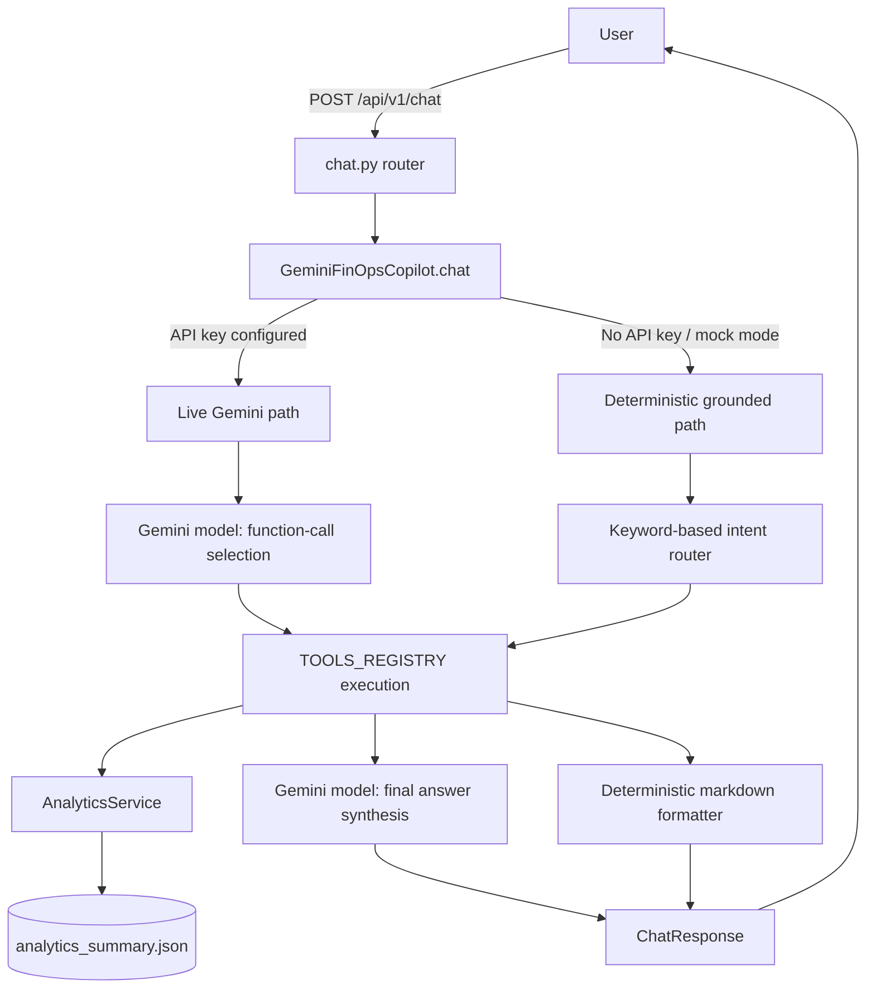

# Gemini FinOps Copilot — Technical Design

This document describes the design of the conversational AI layer implemented
in `src/ai/` and exposed via `POST /api/v1/chat`. It complements
`docs/api_architecture_and_reference.md` (endpoint reference) and
`docs/core_analytics_and_ml.md` (the analytics engines the Copilot calls into).

---

## 1. Purpose

The Copilot lets a user ask FinOps/GreenOps questions in plain language
("Why did my costs spike?", "What's our carbon footprint?") and receive an
answer that is:

- **Numerically accurate** — every figure traces back to the validated
  analytics backend (`AnalyticsService` / `analytics_summary.json`), never to
  the language model's own reasoning.
- **Explainable** — the response states which tool(s) produced the answer and
  which warehouse table(s) back it (`tools_used`, `analytical_sources`).
- **Safe by construction** — the model can only call a fixed, explicit
  whitelist of read-only analytics functions. It cannot execute arbitrary
  Python, SQL, or shell commands, and it cannot access anything outside that
  whitelist.
- **Available without external dependencies** — a deterministic offline mode
  guarantees the application (and its test suite) works with zero API keys
  and zero network calls.

The Copilot is explicitly **not** a second analytics engine. It is a
narration layer over the one analytics engine that already exists
(`src/analytics/`, `src/ml/`).

---

## 2. Architecture



Both paths converge on the same `TOOLS_REGISTRY` functions and the same
`AnalyticsService`, and both produce the same `ChatResponse` schema — the only
difference is *who* decides which tool to call and *who* writes the prose
(Gemini, or the deterministic formatter).

---

## 3. Request Lifecycle

```
User
  → FastAPI  POST /api/v1/chat                (src/api/routers/chat.py)
  → GeminiFinOpsCopilot.chat()                 (src/ai/copilot.py)
      → mock_mode? ──────────────┐
        │ no (live)              │ yes / no API key
        ▼                        ▼
  → Gemini model (function-calling turn)   Deterministic keyword router
  → model selects a tool from                 selects a tool from
    TOOLS_REGISTRY                            TOOLS_REGISTRY
  → analytics tool execution (src/ai/tools.py → AnalyticsService)
  → grounded tool response returned to caller
  → [live only] second Gemini call synthesizes final prose from the tool result
  → ChatResponse assembled (answer, tools_used, analytical_sources,
    relevant_metrics, warnings, is_grounded)
  → FastAPI response back to the user
```

The router (`src/api/routers/chat.py`) contains **no business logic** — it
only validates the `ChatRequest` and delegates to the singleton `copilot`
instance. All Gemini/business logic lives in `src/ai/copilot.py`.

---

## 4. Tool Architecture

Tools are plain Python functions defined in `src/ai/tools.py` and collected
into a single dictionary, `TOOLS_REGISTRY`, which is the **only** surface
through which the Copilot (live or deterministic) can touch the backend:

| Category | Tools | Backs onto |
|---|---|---|
| Cost | `get_cost_summary`, `get_cost_breakdown(dimension)`, `get_cost_trends` | `AnalyticsService.get_cost_summary / get_cost_by_dimension / get_cost_trends` |
| Utilization | `get_resource_utilization`, `get_resource_details(resource_id)` | `AnalyticsService` resource/usage methods |
| Anomalies | `get_anomalies(severity)`, `get_anomaly_details(anomaly_id)` | `AnalyticsService.get_anomalies / get_anomaly_by_id` |
| Optimization | `get_optimization_opportunities(category)`, `simulate_green_migration(resource_id, target_region_id)` | `AnalyticsService.get_optimizations / simulate_green_migration` |
| Carbon | `get_carbon_summary`, `get_carbon_by_region` | `AnalyticsService.get_carbon_summary / get_carbon_by_region` |
| Forecasting | `get_forecast(horizon_days)`, `get_forecast_models` | `AnalyticsService.get_forecast_projections / get_forecast_models` |
| Root cause | `run_root_cause_analysis(query)` | Synthesizes anomalies + top-spend services + waste signals from multiple `AnalyticsService` calls |

Each function has a Python type-annotated signature and docstring, which the
`google-genai` SDK uses to auto-generate the Gemini function-calling schema
(`FunctionDeclaration.from_callable_with_api_option`) in live mode. The same
functions and the same docstrings drive the `/api/v1/ai/tools-manifest`
endpoint used for external tool-calling introspection.

**In live mode, only functions present in `TOOLS_REGISTRY` are ever invoked** —
the code explicitly checks `if fn_name in TOOLS_REGISTRY` before calling
anything, even though the function name comes from Gemini's own output.

---

## 5. Grounding Contract

The Copilot obeys one non-negotiable rule, encoded both in the system prompt
and in the code structure itself:

> **Every numerical claim in a response must come from a `TOOLS_REGISTRY`
> function's return value. The model must never invent, estimate, or
> independently calculate a cost, savings, utilization, anomaly, forecast, or
> carbon figure. If the requested data is unavailable, the response must say
> so explicitly rather than approximating.**

This is enforced structurally, not just by prompting:
- The deterministic engine's answer strings are built by directly
  interpolating tool-result dictionaries — there's no code path where it
  could "make up" a number.
- The live-mode second Gemini turn is instructed (`MASTER_SYSTEM_INSTRUCTION`)
  to synthesize its answer strictly from the function-response content it was
  just given.
- `ChatResponse.relevant_metrics` exposes the exact tool-derived numbers used
  in the answer, so any number in `answer` can be cross-checked mechanically
  (this is exercised directly in `tests/test_ai_copilot.py`).
- Questions about infrastructure the dataset doesn't model (e.g., "my AWS
  spend," "my Azure spend" — this project is GCP-only) are routed to **no
  tool at all**; the response states the data is not available and
  `relevant_metrics` is empty.

---

## 6. Deterministic / Offline Mode

**Why it exists:**
- The application must be fully testable (and runnable) without any external
  API key or network access — this is what CI, and any environment without a
  configured Gemini key, uses by default.
- It provides a zero-hallucination-risk fallback: since the response is
  built entirely from string templates around tool output, there is no
  generative step where wording drift could introduce an incorrect number.

**How it works** (`GeminiFinOpsCopilot._execute_grounded_deterministic_chat`):
1. The user's message is lower-cased and matched against ordered keyword
   groups (root cause → anomalies → optimization → carbon → forecast → cost
   trend → cost breakdown → default cost summary → unsupported-cloud check).
2. The first matching intent calls the corresponding `TOOLS_REGISTRY`
   function(s).
3. A markdown-formatted answer is built directly from the tool's returned
   dictionary/list — every number in the template is a dictionary lookup, not
   a generated token.
4. The same `ChatResponse` shape is returned as in live mode, including
   `tools_used`, `analytical_sources`, `relevant_metrics`, and any relevant
   `warnings` (e.g. the carbon-estimate disclaimer, or causation hedging for
   root-cause answers).

This mode is selected automatically whenever `ai_config.mock_mode` is `True`
**or** no Gemini API key is configured — see `GeminiFinOpsCopilot.__init__`.

---

## 7. Gemini SDK Integration

The live path (`_execute_live_gemini_chat`) uses the `google-genai` Python
SDK (`google.genai`) against the `client.models.generate_content` API.
During this implementation phase, the integration was verified directly
against the installed SDK version, and two compatibility decisions were made:

**Automatic function calling is explicitly disabled.**
```python
config = types.GenerateContentConfig(
    ...
    tools=tools_list,
    automatic_function_calling=types.AutomaticFunctionCallingConfig(disable=True),
)
```
By default, the `google-genai` SDK will execute Python callables passed as
`tools` on its own and transparently merge the result back into the response.
This application instead performs **its own controlled, manual dispatch**:
it inspects `response.function_calls`, checks the requested function name
against `TOOLS_REGISTRY` explicitly, executes it itself, and constructs the
follow-up turn manually. Disabling automatic function calling makes this the
single, predictable execution path, and keeps a hard boundary between "what
Gemini is allowed to trigger" and "what the SDK might do on its own."

**Function-response messages use `role="user"`.**
The current SDK's `Content` model only accepts `"user"` or `"model"` as a
role (there is no `"tool"` role in this SDK version). The function-response
`Part` is therefore sent back as part of a `role="user"` message, per the
SDK's documented `Content` contract.

**Tool execution failures are handled gracefully.**
Each tool call is wrapped in a `try/except`. If the tool raises (for example,
a lookup for a nonexistent anomaly or resource ID), the exception is caught,
logged, and a structured "unavailable" result is substituted so the
conversation can still complete with an honest, grounded message instead of
a raw error.

**A top-level safety/error guard wraps the entire chat dispatch.**
`GeminiFinOpsCopilot.chat()` wraps both the live and deterministic paths in a
single `try/except`. Any unexpected failure anywhere in the pipeline degrades
to a safe, grounded `ChatResponse` (with `warnings` populated) rather than
propagating a 500 error to the caller.

---

## 8. Prompting Strategy

`MASTER_SYSTEM_INSTRUCTION` (`src/ai/prompts.py`) sets the ground rules for
the live Gemini path:

- **Strict numerical grounding**: all figures must come from tool output.
- **Missing-data transparency**: if a tool doesn't cover the question, say so
  plainly instead of guessing.
- **Carbon-as-estimate disclaimer**: carbon figures must be framed as
  modeled estimates, never as an official cloud-provider measurement.
- **Causation hedging**: root-cause / "why did X happen" answers must
  present correlational evidence (e.g., "anomalies co-occurred with a spend
  spike in the same window") without asserting definitive causation.
- **Structured reasoning workflow**: identify the question's intent, call the
  appropriate tool(s), then synthesize — rather than answering from general
  knowledge about cloud computing.

---

## 9. Carbon Methodology Disclaimer

All carbon figures produced by this system — whether from the API directly
(`/api/v1/carbon/*`) or through the Copilot — are **estimates derived from
this project's own modeling assumptions**: server power benchmarks, a PUE
(Power Usage Effectiveness) factor, and regional electricity grid
carbon-intensity figures baked into the synthetic data generator
(`src/generator/config.py`). They are **not** official Google Cloud Carbon
Footprint measurements and should not be treated as such. The Copilot
surfaces this distinction explicitly via the `warnings` field whenever a
response includes carbon data.

---

## 10. Security & Configuration

- The Gemini API key is read **only** from environment variables —
  `GEMINI_API_KEY`, `CLOUDSENSE_GEMINI_API_KEY`, or the pydantic-settings
  prefixed form `CLOUDSENSE_AI_GEMINI_API_KEY` (`src/ai/config.py`,
  `AIConfig`, env prefix `CLOUDSENSE_AI_`). It is never hardcoded in source,
  never committed, and never printed to logs.
- Other configuration: `CLOUDSENSE_AI_GEMINI_MODEL` (or the plain
  `CLOUDSENSE_GEMINI_MODEL` fallback) selects the model (default
  `gemini-2.0-flash`); `CLOUDSENSE_AI_MOCK_MODE` forces deterministic mode
  regardless of whether a key is present.
- The Copilot cannot execute arbitrary Python, SQL, or shell commands. Its
  only capability is calling one of the fixed, read-only functions in
  `TOOLS_REGISTRY`, each of which returns data already computed and
  validated by the analytics backend.
- No endpoint in this system exposes the raw API key, environment variables,
  or internal credentials in any response payload.

---

## 11. Testing Strategy

`tests/test_ai_copilot.py` covers the deterministic path end-to-end (no
network access required), including:

- Basic chat request shape and health of the endpoint
- Cost, cost-breakdown, cost-trend, anomaly, optimization, carbon, forecast,
  and root-cause questions — each asserted to call the expected tool and to
  return `relevant_metrics` that match `AnalyticsService` exactly
- An "unavailable data" question (asking about an unmonitored cloud
  provider), asserting `tools_used` and `relevant_metrics` stay empty
- Invalid requests (too-short message, missing field) return `422`
- A tool raising `HTTPException` for an unknown ID is asserted directly
- A simulated live-mode tool failure is asserted to degrade gracefully
  instead of raising
- Grounding/hallucination checks that cross-reference every numeric field in
  the response against `AnalyticsService` output directly

A separate test, `test_live_gemini_chat_smoke`, is decorated with
`@pytest.mark.skipif` and only runs when a real
`GEMINI_API_KEY`/`CLOUDSENSE_GEMINI_API_KEY` is present in the environment —
it is skipped by design everywhere else, including CI.

Current result: **39 passed, 1 skipped**.

---

## 12. Extension Points

To add a new capability to the Copilot:

1. Add a new function to `src/ai/tools.py` with a clear type-annotated
   signature and docstring (this becomes the function-calling schema in live
   mode).
2. Register it in `TOOLS_REGISTRY`.
3. If it should also be reachable from the deterministic offline mode, add a
   new keyword-matched case in
   `GeminiFinOpsCopilot._execute_grounded_deterministic_chat` that calls the
   new tool and formats a grounded markdown answer from its result.
4. No changes to `src/api/routers/chat.py` are needed — the router is
   intentionally decoupled from the tool set.
5. Add a corresponding test in `tests/test_ai_copilot.py` asserting the new
   tool is invoked and that `relevant_metrics` matches the underlying
   `AnalyticsService` call exactly.

Because every tool is a plain, whitelisted, read-only Python function
against the same validated analytics backend, new tools cannot introduce new
categories of risk (arbitrary code execution, write access, etc.) as long as
this pattern is followed.
